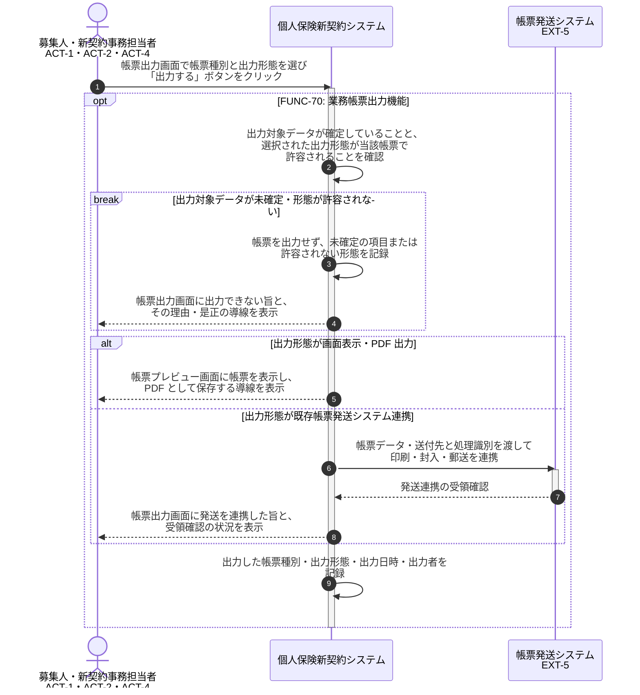

# UC-70: 業務帳票を出力する

- **事前条件**: 設計書・申込控え・告知書・保険証券 等の出力対象帳票と、その出力形態(画面表示・PDF 出力・既存帳票発送システム連携)が特定できる
- **事後条件**: 指定された形態で業務帳票が出力され、出力内容・出力日時・出力者が記録された状態になる。物理交付を伴う場合は既存帳票発送システムへの連携結果まで記録する。出力対象のデータが確定していない場合は出力しない

