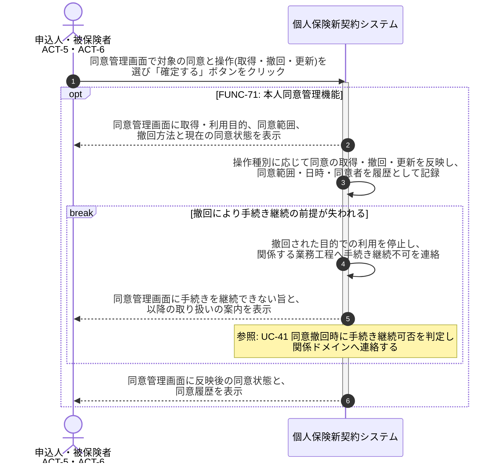

# UC-71: 本人同意を取得・撤回・更新する

- **事前条件**: 個人情報・要配慮個人情報の取得局面にある、または本人から同意の撤回・更新の申し出がある
- **事後条件**: 取得・利用目的を明示したうえで同意が取得・撤回・更新され、その履歴(同意範囲・日時・同意者)が管理された状態になる。撤回後は撤回された目的での利用が停止される

```mermaid
sequenceDiagram
    autonumber
    actor act5_6 as 申込人・被保険者<br/>ACT-5・ACT-6
    participant sys as 個人保険新契約システム

    act5_6->>sys: 同意管理画面で対象の同意と操作(取得・撤回・更新)を<br/>選び「確定する」ボタンをクリック
    activate sys

    opt FUNC-71: 本人同意管理機能
        sys-->>act5_6: 同意管理画面に取得・利用目的、同意範囲、<br/>撤回方法と現在の同意状態を表示
        sys->>sys: 操作種別に応じて同意の取得・撤回・更新を反映し、<br/>同意範囲・日時・同意者を履歴として記録

        break 撤回により手続き継続の前提が失われる
            sys->>sys: 撤回された目的での利用を停止し、<br/>関係する業務工程へ手続き継続不可を連絡
            sys-->>act5_6: 同意管理画面に手続きを継続できない旨と、<br/>以降の取り扱いの案内を表示
            Note over sys: 参照: UC-41 同意撤回時に手続き継続可否を判定し<br/>関係ドメインへ連絡する
        end

        sys-->>act5_6: 同意管理画面に反映後の同意状態と、<br/>同意履歴を表示
    end

    deactivate sys
```
