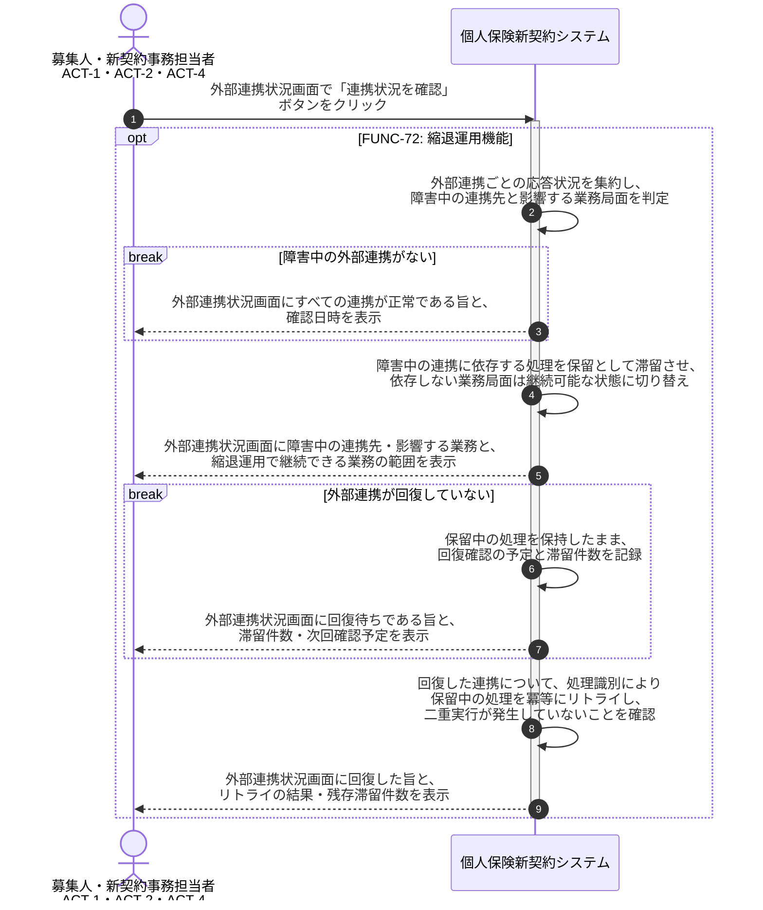

# UC-72: 外部連携障害時に縮退運用する

- **事前条件**: 外部連携(本人確認・反社チェック・電子署名・決済・契約管理・帳票発送)のいずれかで障害が検知されている
- **事後条件**: 主要ドメインが単独で局所稼働し、事務側業務も縮退運用で継続できる状態になる。外部連携の回復後は処理識別により冪等にリトライされ、二重実行が発生しない

```mermaid
sequenceDiagram
    autonumber
    actor act1_2_4 as 募集人・新契約事務担当者<br/>ACT-1・ACT-2・ACT-4
    participant sys as 個人保険新契約システム

    act1_2_4->>sys: 外部連携状況画面で「連携状況を確認」<br/>ボタンをクリック
    activate sys

    opt FUNC-72: 縮退運用機能
        sys->>sys: 外部連携ごとの応答状況を集約し、<br/>障害中の連携先と影響する業務局面を判定

        break 障害中の外部連携がない
            sys-->>act1_2_4: 外部連携状況画面にすべての連携が正常である旨と、<br/>確認日時を表示
        end

        sys->>sys: 障害中の連携に依存する処理を保留として滞留させ、<br/>依存しない業務局面は継続可能な状態に切り替え
        sys-->>act1_2_4: 外部連携状況画面に障害中の連携先・影響する業務と、<br/>縮退運用で継続できる業務の範囲を表示

        break 外部連携が回復していない
            sys->>sys: 保留中の処理を保持したまま、<br/>回復確認の予定と滞留件数を記録
            sys-->>act1_2_4: 外部連携状況画面に回復待ちである旨と、<br/>滞留件数・次回確認予定を表示
        end

        sys->>sys: 回復した連携について、処理識別により<br/>保留中の処理を冪等にリトライし、<br/>二重実行が発生していないことを確認
        sys-->>act1_2_4: 外部連携状況画面に回復した旨と、<br/>リトライの結果・残存滞留件数を表示
    end

    deactivate sys
```
