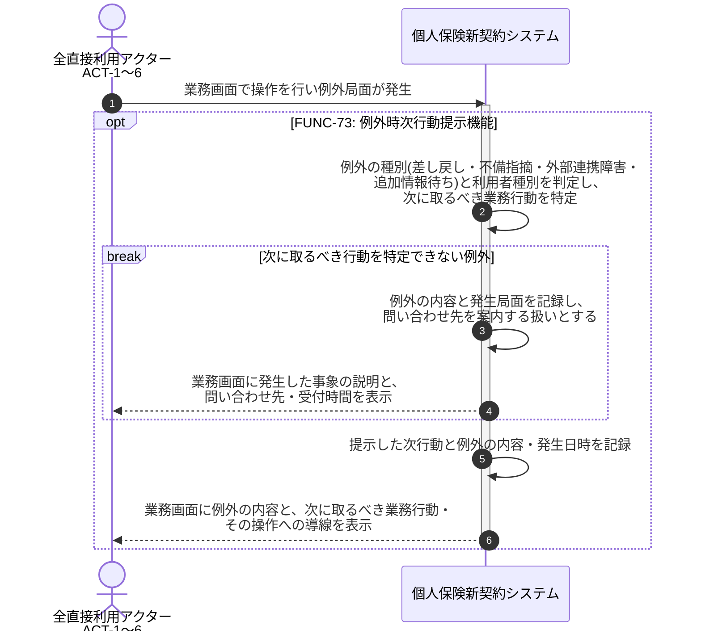

# UC-73: 例外局面で次に取るべき業務行動を提示する

- **事前条件**: 差し戻し・不備指摘・外部連携障害・追加情報待ち 等の例外局面が発生し、利用者種別と当該例外の種別が特定できる
- **事後条件**: 利用者種別に応じて次に取るべき業務上の行動が画面に明示され、その導線から後続操作へ進める状態になる。行動を特定できない例外であっても、問い合わせ先を含む案内を提示し「理由の分からないエラー表示」で終わらせない

