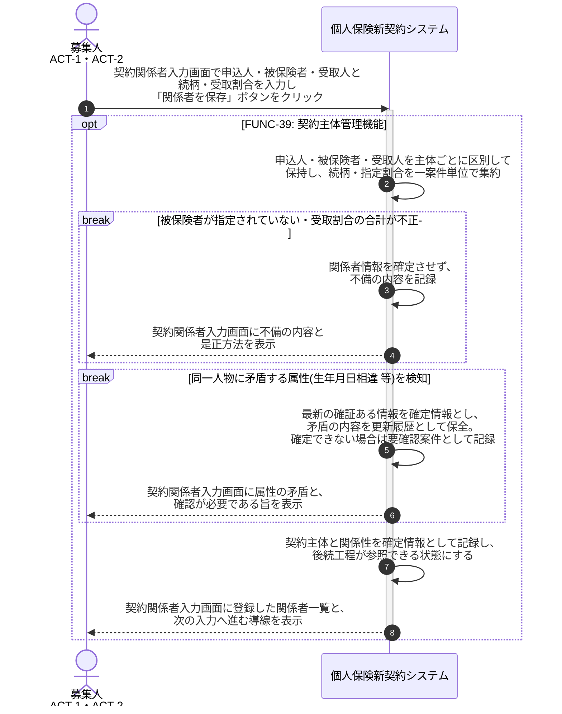

# UC-39: 契約主体(申込人/被保険者/受取人)を区別して保持する

- **事前条件**: 意向把握または申込受付で申込人・被保険者・受取人の情報を入力する状態にある
- **事後条件**: 申込人・被保険者・受取人が契約上の権利義務の違いに応じて区別して保持され、受取人の複数指定や被保険者=申込人の組合せも含めて相互関係(続柄・指定割合)が一案件単位で集約された状態になる。被保険者が存在しない申込や属性の矛盾は確定させない

