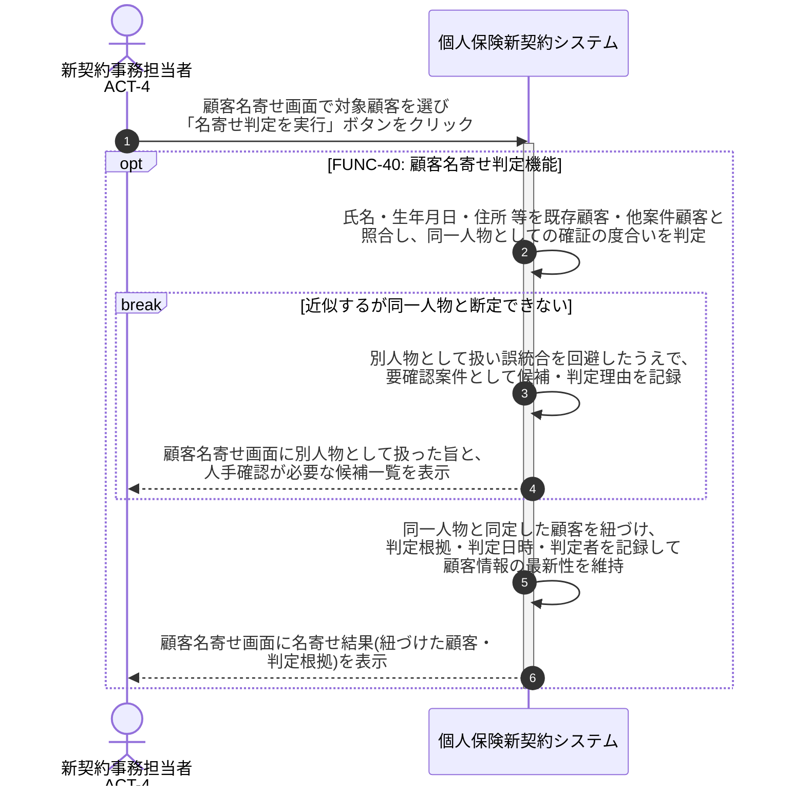

# UC-40: 顧客を名寄せ判定する(不確実時は別人物扱い)

- **事前条件**: 入力された顧客情報について、既存顧客・他案件顧客との同定判定を行う状態にある
- **事後条件**: 氏名・生年月日・住所 等から同一人物と同定できた場合は既存顧客と紐づけられ、確証が得られない場合は別人物として扱われたうえで要確認案件として人手確認に回された状態になる。誤統合は行わない

```mermaid
sequenceDiagram
    autonumber
    actor act4 as 新契約事務担当者<br/>ACT-4
    participant sys as 個人保険新契約システム

    act4->>sys: 顧客名寄せ画面で対象顧客を選び<br/>「名寄せ判定を実行」ボタンをクリック
    activate sys

    opt FUNC-40: 顧客名寄せ判定機能
        sys->>sys: 氏名・生年月日・住所 等を既存顧客・他案件顧客と<br/>照合し、同一人物としての確証の度合いを判定

        break 近似するが同一人物と断定できない
            sys->>sys: 別人物として扱い誤統合を回避したうえで、<br/>要確認案件として候補・判定理由を記録
            sys-->>act4: 顧客名寄せ画面に別人物として扱った旨と、<br/>人手確認が必要な候補一覧を表示
        end

        sys->>sys: 同一人物と同定した顧客を紐づけ、<br/>判定根拠・判定日時・判定者を記録して<br/>顧客情報の最新性を維持
        sys-->>act4: 顧客名寄せ画面に名寄せ結果(紐づけた顧客・<br/>判定根拠)を表示
    end

    deactivate sys
```
