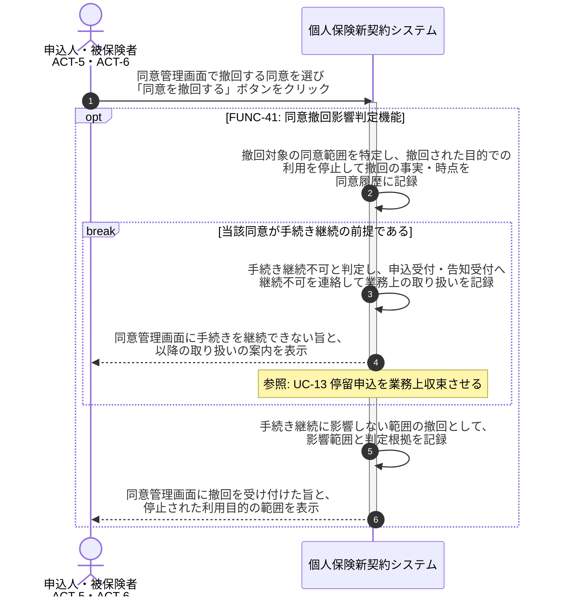

# UC-41: 同意撤回時に手続き継続可否を判定し関係ドメインへ連絡する

- **事前条件**: 本人(申込人または被保険者)から個人情報利用の同意撤回の意思表示があり、対象の同意履歴が特定できる
- **事後条件**: 撤回された目的での利用が停止され、当該同意が手続き継続の前提である場合は申込受付・告知受付へ手続き継続不可が連絡された状態になる。撤回の事実と時点が同意履歴に記録される

