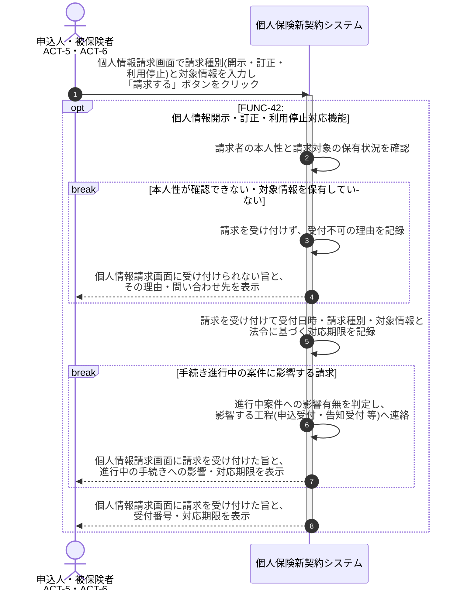

# UC-42: 個人情報の開示・訂正・利用停止請求に対応する

- **事前条件**: 本人から法令に基づく保有個人情報の開示・訂正・利用停止の請求があり、本人性が確認できる状態にある
- **事後条件**: 請求内容が受け付けられ、対応期限とともに業務手続きへ回付された状態になる。手続き進行中の案件がある場合は影響有無が判定され関係工程へ連絡される。本人性が確認できない場合は請求を受け付けない

