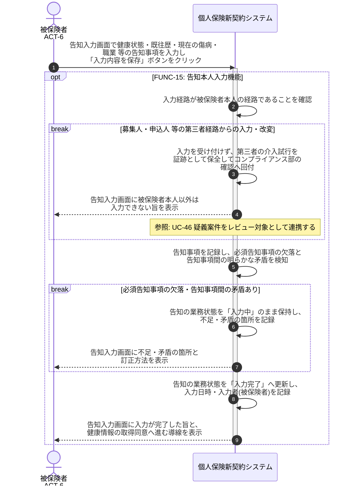

# UC-14: 告知を本人入力する

- **事前条件**: 申込確定を受けて告知受付が起動し、告知の業務状態が「告知依頼済」で被保険者本人の入力経路が用意されている
- **事後条件**: 健康状態・既往歴・現在の傷病・職業 等の告知事項が被保険者本人の経路で記録され、必須項目の欠落と告知事項間の矛盾がない状態で業務状態が「入力完了」になる。第三者による代理入力・改変は受け付けず、疑い事象を証跡として保全する

