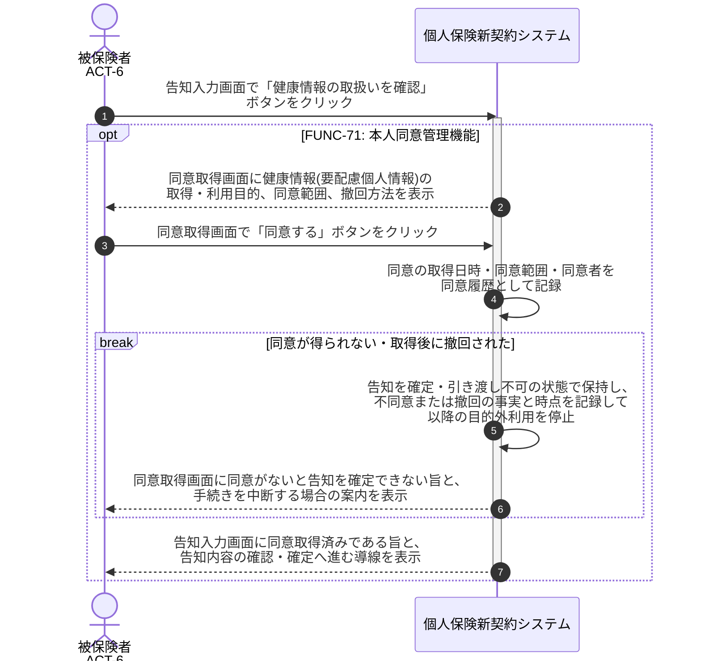

# UC-15: 要配慮個人情報の取得同意を取得する

- **事前条件**: 告知の業務状態が「入力完了」で、健康情報(要配慮個人情報)の取得・利用目的を明示すべき状態
- **事後条件**: 健康情報の取得・利用目的が本人に明示され、同意の取得日時・同意範囲・同意者が同意履歴として記録される。同意が得られない場合や取得後に撤回された場合は、告知を確定・引き渡しできない状態を保ち、以降の利用を停止する

