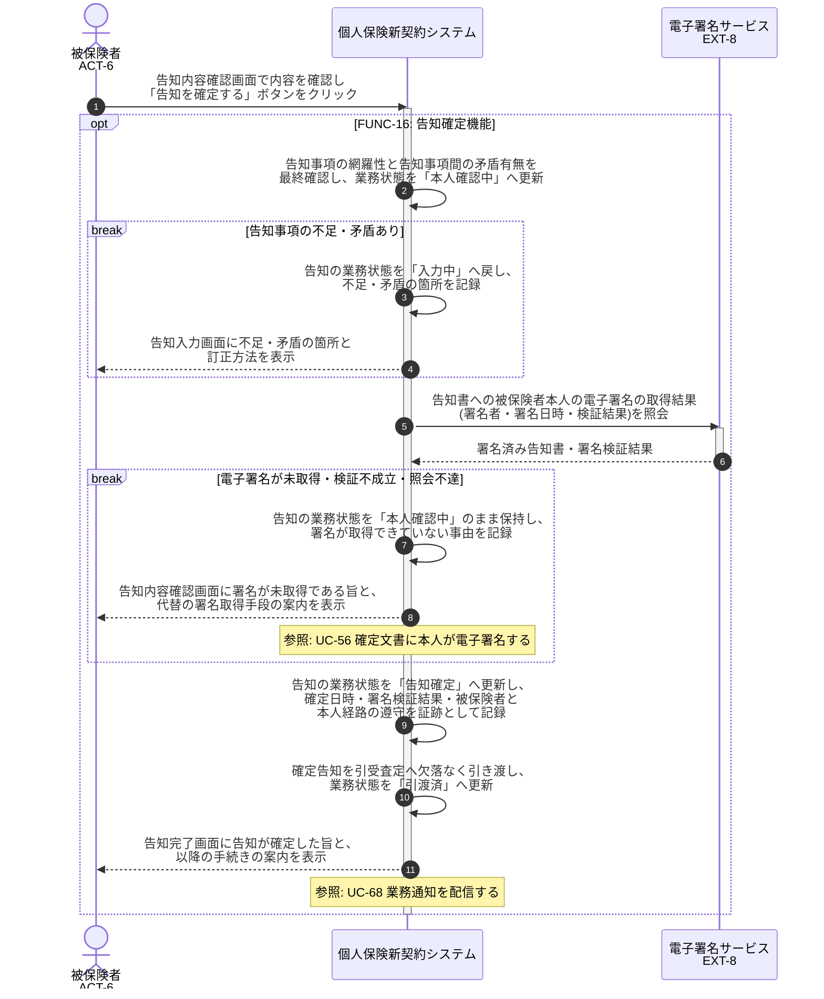

# UC-16: 告知を本人確認・電子署名で確定する

- **事前条件**: 告知の業務状態が「入力完了」で、健康情報の取得同意が取得済み
- **事後条件**: 被保険者本人が内容を確認し電子署名が取得された状態で告知の業務状態が「告知確定」となり、募集コンプライアンス証跡が記録されたうえで引受査定へ引き渡される。電子署名が取得できない場合は「本人確認中」のまま確定させず、代替の署名取得手段を画面に返す

