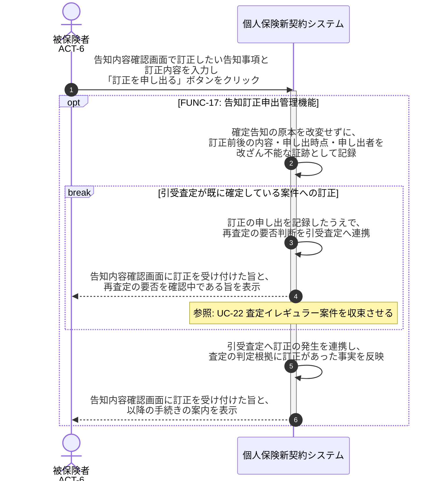

# UC-17: 確定告知の訂正を申し出る

- **事前条件**: 告知の業務状態が「告知確定」または「引渡済」で、被保険者から告知内容の訂正の申し出がある
- **事後条件**: 訂正の申し出と訂正前後の内容・申し出時点が改ざん不能な証跡として記録され、引受査定へ訂正発生が連携された状態になる。原本の確定告知は改変せずに保持する

```mermaid
sequenceDiagram
    autonumber
    actor act6 as 被保険者<br/>ACT-6
    participant sys as 個人保険新契約システム

    act6->>sys: 告知内容確認画面で訂正したい告知事項と<br/>訂正内容を入力し<br/>「訂正を申し出る」ボタンをクリック
    activate sys

    opt FUNC-17: 告知訂正申出管理機能
        sys->>sys: 確定告知の原本を改変せずに、<br/>訂正前後の内容・申し出時点・申し出者を<br/>改ざん不能な証跡として記録

        break 引受査定が既に確定している案件への訂正
            sys->>sys: 訂正の申し出を記録したうえで、<br/>再査定の要否判断を引受査定へ連携
            sys-->>act6: 告知内容確認画面に訂正を受け付けた旨と、<br/>再査定の要否を確認中である旨を表示
            Note over sys: 参照: UC-22 査定イレギュラー案件を収束させる
        end

        sys->>sys: 引受査定へ訂正の発生を連携し、<br/>査定の判定根拠に訂正があった事実を反映
        sys-->>act6: 告知内容確認画面に訂正を受け付けた旨と、<br/>以降の手続きの案内を表示
    end

    deactivate sys
```
