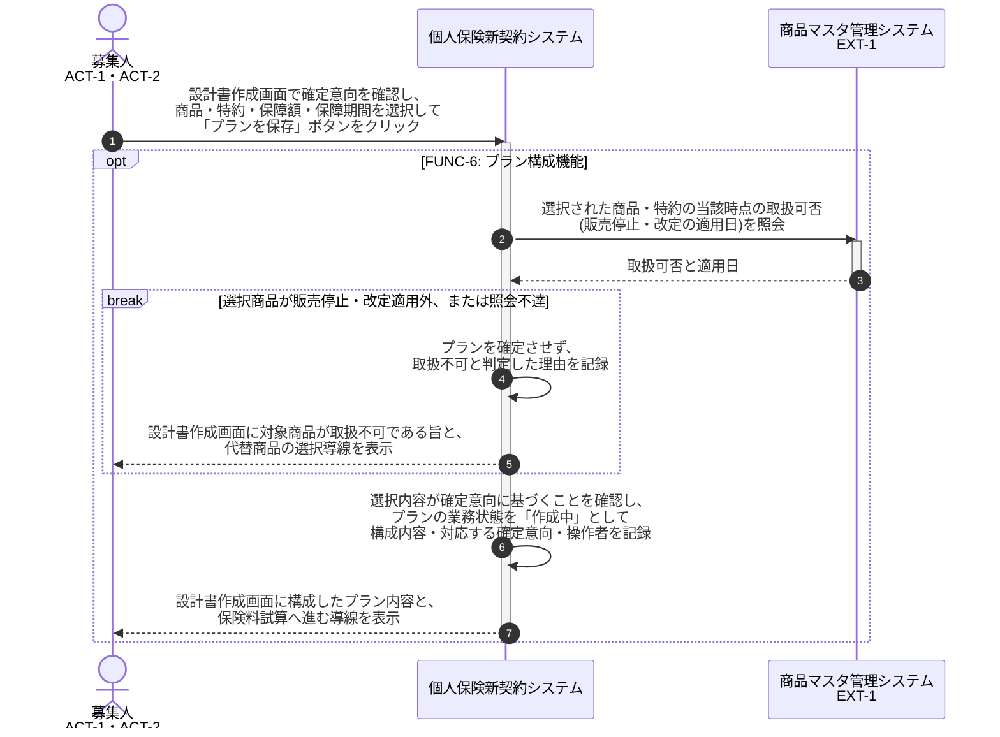

# UC-6: 確定意向を受領し商品・特約を選択してプランを構成する

- **事前条件**: 意向把握で意向が確定し設計書作成へ引き渡されている
- **事後条件**: 募集権限内かつ当該時点で取扱可能な商品・特約でプランが構成され、業務状態が「作成中」として記録される。対象商品が販売停止・改定適用前後で取扱不可の場合はプランを構成せず、代替商品の選択導線を画面に返す

```mermaid
sequenceDiagram
    autonumber
    actor act1_2 as 募集人<br/>ACT-1・ACT-2
    participant sys as 個人保険新契約システム
    participant ext1 as 商品マスタ管理システム<br/>EXT-1

    act1_2->>sys: 設計書作成画面で確定意向を確認し、<br/>商品・特約・保障額・保障期間を選択して<br/>「プランを保存」ボタンをクリック
    activate sys

    opt FUNC-6: プラン構成機能
        sys->>ext1: 選択された商品・特約の当該時点の取扱可否<br/>(販売停止・改定の適用日)を照会
        activate ext1
        ext1-->>sys: 取扱可否と適用日
        deactivate ext1

        break 選択商品が販売停止・改定適用外、または照会不達
            sys->>sys: プランを確定させず、<br/>取扱不可と判定した理由を記録
            sys-->>act1_2: 設計書作成画面に対象商品が取扱不可である旨と、<br/>代替商品の選択導線を表示
        end

        sys->>sys: 選択内容が確定意向に基づくことを確認し、<br/>プランの業務状態を「作成中」として<br/>構成内容・対応する確定意向・操作者を記録
        sys-->>act1_2: 設計書作成画面に構成したプラン内容と、<br/>保険料試算へ進む導線を表示
    end

    deactivate sys
```
