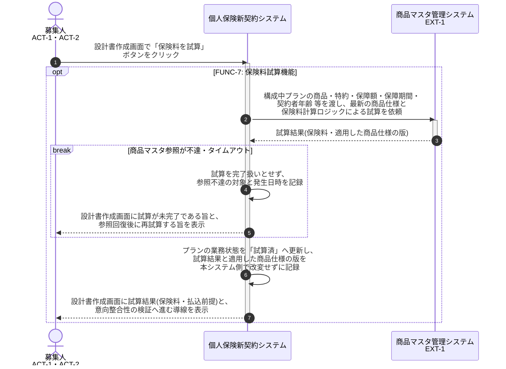

# UC-7: 保険料を試算する

- **事前条件**: プランの業務状態が「作成中」で、商品・特約・保障額・保障期間が構成済み
- **事後条件**: 商品マスタ管理システムの最新の商品仕様・保険料計算ロジックに準拠した試算結果が得られ、業務状態が「試算済」になる。参照が不達の場合は試算を完了扱いとせず、参照回復後に再試算する旨を画面に返す

```mermaid
sequenceDiagram
    autonumber
    actor act1_2 as 募集人<br/>ACT-1・ACT-2
    participant sys as 個人保険新契約システム
    participant ext1 as 商品マスタ管理システム<br/>EXT-1

    act1_2->>sys: 設計書作成画面で「保険料を試算」<br/>ボタンをクリック
    activate sys

    opt FUNC-7: 保険料試算機能
        sys->>ext1: 構成中プランの商品・特約・保障額・保障期間・<br/>契約者年齢 等を渡し、最新の商品仕様と<br/>保険料計算ロジックによる試算を依頼
        activate ext1
        ext1-->>sys: 試算結果(保険料・適用した商品仕様の版)
        deactivate ext1

        break 商品マスタ参照が不達・タイムアウト
            sys->>sys: 試算を完了扱いとせず、<br/>参照不達の対象と発生日時を記録
            sys-->>act1_2: 設計書作成画面に試算が未完了である旨と、<br/>参照回復後に再試算する旨を表示
        end

        sys->>sys: プランの業務状態を「試算済」へ更新し、<br/>試算結果と適用した商品仕様の版を<br/>本システム側で改変せずに記録
        sys-->>act1_2: 設計書作成画面に試算結果(保険料・払込前提)と、<br/>意向整合性の検証へ進む導線を表示
    end

    deactivate sys
```
