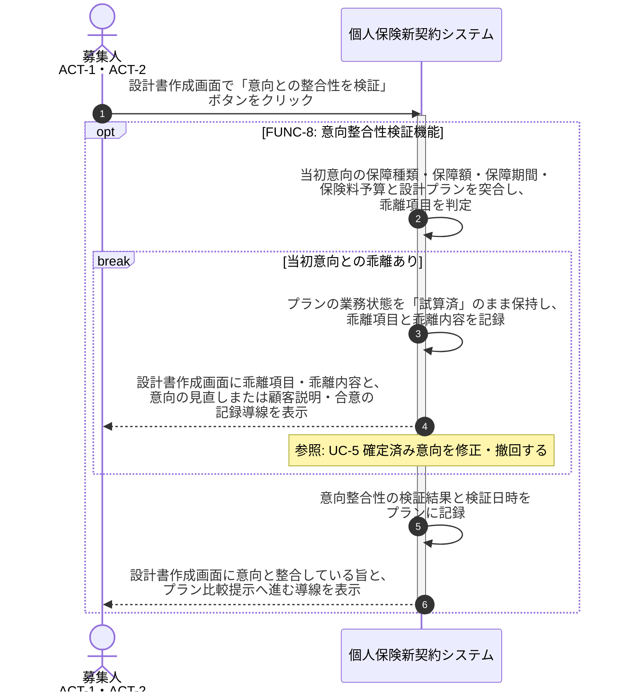

# UC-8: 設計プランの意向整合性を検証する

- **事前条件**: プランの業務状態が「試算済」で、当初意向(保障種類・保障額・保障期間・保険料予算)が参照可能
- **事後条件**: 当初意向と設計プランの乖離有無が判定され、乖離がない場合はプラン確定へ進める状態になる。乖離がある場合は乖離内容を画面に明示し、意向の見直しまたは顧客への説明・合意のいずれかを経るまで申込へ引き渡せない状態を保つ

