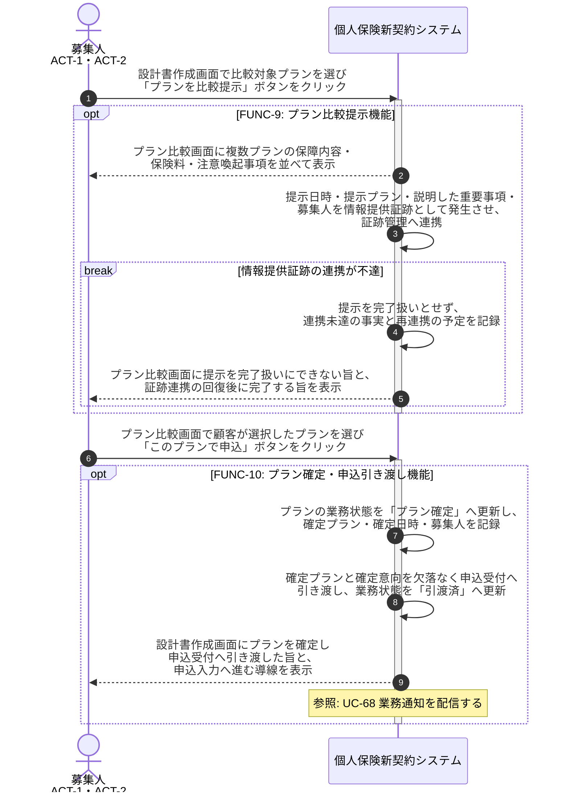

# UC-9: 複数プランを比較・提示し確定して申込へ引き渡す

- **事前条件**: 意向整合性の検証を終えた設計プランが 1 つ以上あり、顧客へ比較提示できる状態
- **事後条件**: 重要事項(保障内容・保険料・注意喚起事項)の説明事実が情報提供証跡として発生し、顧客が選択した単一プランの業務状態が「プラン確定」を経て「引渡済」になる。証跡連携が不達の場合は提示・確定を完了扱いとしない

