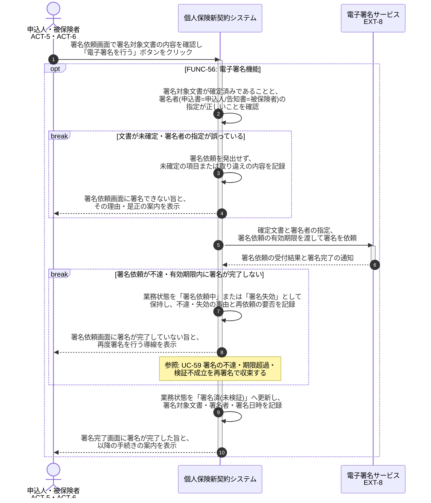

# UC-56: 確定文書に本人が電子署名する

- **事前条件**: 署名対象文書(申込書・告知書 等)の内容が確定し、当該文書の取扱い説明・同意が完了していて、業務状態が「署名対象確定」
- **事後条件**: 申込書は申込人、告知書は被保険者という署名者の指定のもとで外部電子署名サービスへ署名依頼が発出され、署名完了により業務状態が「署名済(未検証)」になる。署名者の取り違えや署名後の文書変更が判明した場合は当該署名を無効とし再署名を依頼する

