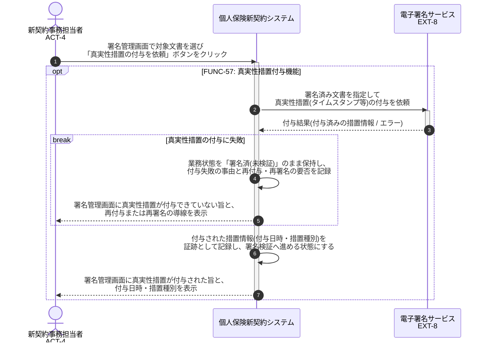

# UC-57: 真実性措置(タイムスタンプ)付与を外部サービスへ依頼する

- **事前条件**: 業務状態が「署名済(未検証)」で、署名済み文書に対する真実性措置の付与が必要
- **事後条件**: 外部電子署名サービスにより真実性措置(タイムスタンプ等)が付与され、付与結果が記録された状態になる。付与に失敗した場合は署名検証済みへ進めず、再付与または再署名を依頼する。本システムは真実性措置を独自に生成しない

