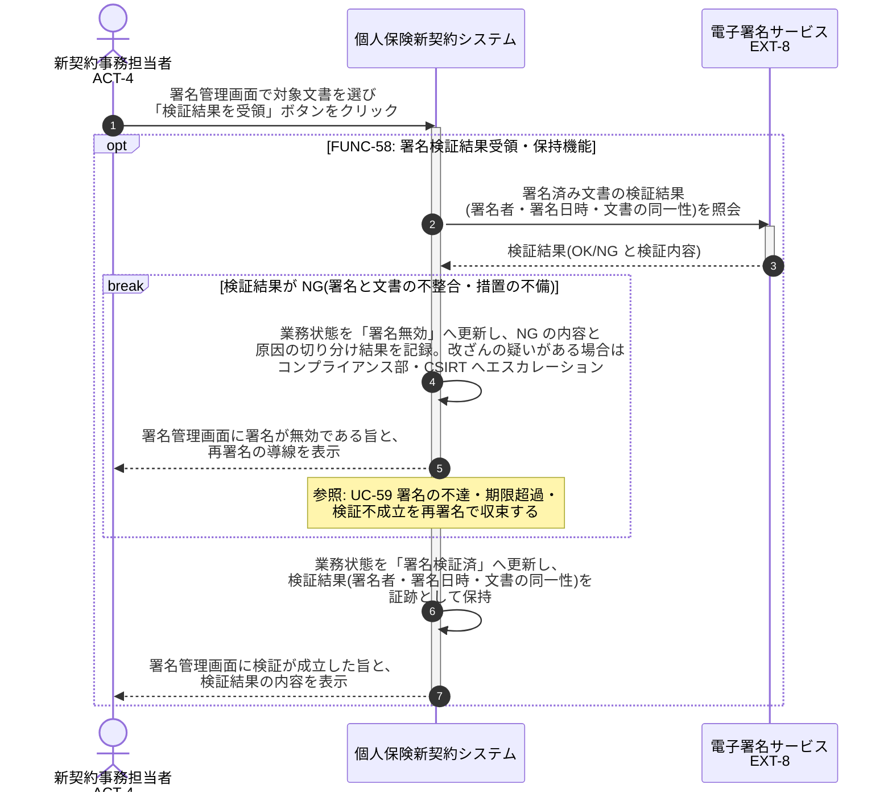

# UC-58: 外部署名検証結果を受領し証跡として保持する

- **事前条件**: 署名済み文書に真実性措置が付与され、外部電子署名サービスによる検証結果を受領できる状態
- **事後条件**: 署名者・署名日時・文書の同一性に関する外部サービスの検証結果が証跡として保持され、業務状態が「署名検証済」になる。検証 NG の場合は「署名無効」として再署名の対象とし、改ざんの疑いがある場合はエスカレーションする。本システムは独自の検証アルゴリズムを実装しない

