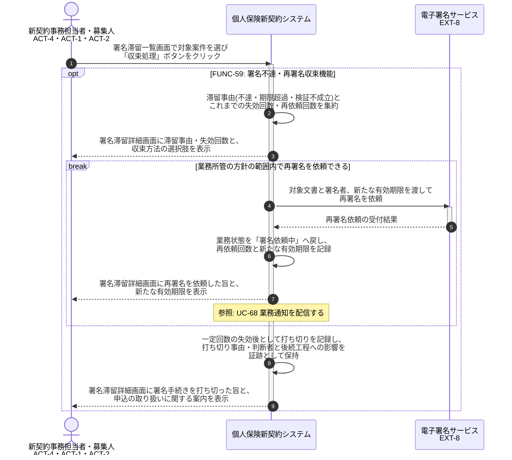

# UC-59: 署名の不達・期限超過・検証不成立を再署名で収束する

- **事前条件**: 外部不達・署名依頼の有効期限超過・検証 NG のいずれかが発生し、業務状態が「署名依頼中」「署名失効」「署名無効」のまま滞留している
- **事後条件**: 再署名の依頼により業務状態が「署名依頼中」へ戻るか、一定回数の失効後は業務所管の判断で打ち切りとして収束した状態になる。いずれの場合も収束の事由と経緯が証跡として記録される

