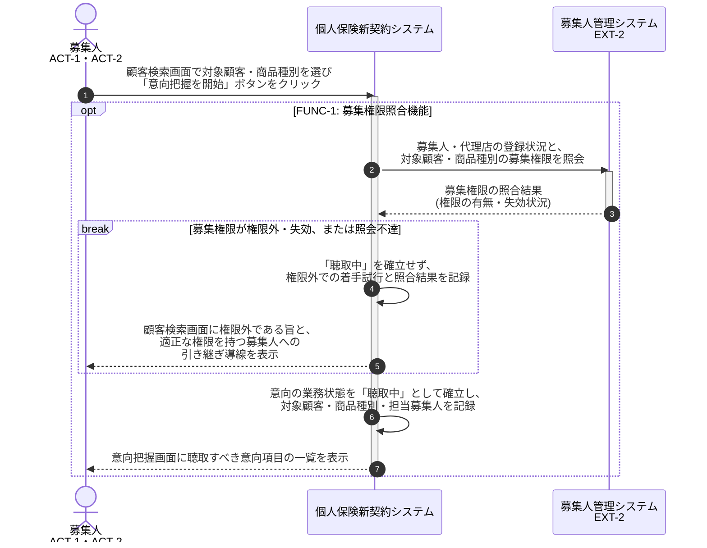

# UC-1: 意向把握を開始し募集権限を確認する

- **事前条件**: 対象顧客と商品種別が特定され、当該案件の意向はまだ「聴取中」として確立していない
- **事後条件**: 募集権限が確認され意向の業務状態が「聴取中」になる。権限外・権限失効の場合は「聴取中」を確立せず、引き継ぎ先募集人への移管導線を画面に返す

```mermaid
sequenceDiagram
    autonumber
    actor act1_2 as 募集人<br/>ACT-1・ACT-2
    participant sys as 個人保険新契約システム
    participant ext2 as 募集人管理システム<br/>EXT-2

    act1_2->>sys: 顧客検索画面で対象顧客・商品種別を選び<br/>「意向把握を開始」ボタンをクリック
    activate sys

    opt FUNC-1: 募集権限照合機能
        sys->>ext2: 募集人・代理店の登録状況と、<br/>対象顧客・商品種別の募集権限を照会
        activate ext2
        ext2-->>sys: 募集権限の照合結果<br/>(権限の有無・失効状況)
        deactivate ext2

        break 募集権限が権限外・失効、または照会不達
            sys->>sys: 「聴取中」を確立せず、<br/>権限外での着手試行と照合結果を記録
            sys-->>act1_2: 顧客検索画面に権限外である旨と、<br/>適正な権限を持つ募集人への<br/>引き継ぎ導線を表示
        end

        sys->>sys: 意向の業務状態を「聴取中」として確立し、<br/>対象顧客・商品種別・担当募集人を記録
        sys-->>act1_2: 意向把握画面に聴取すべき意向項目の一覧を表示
    end

    deactivate sys
```
