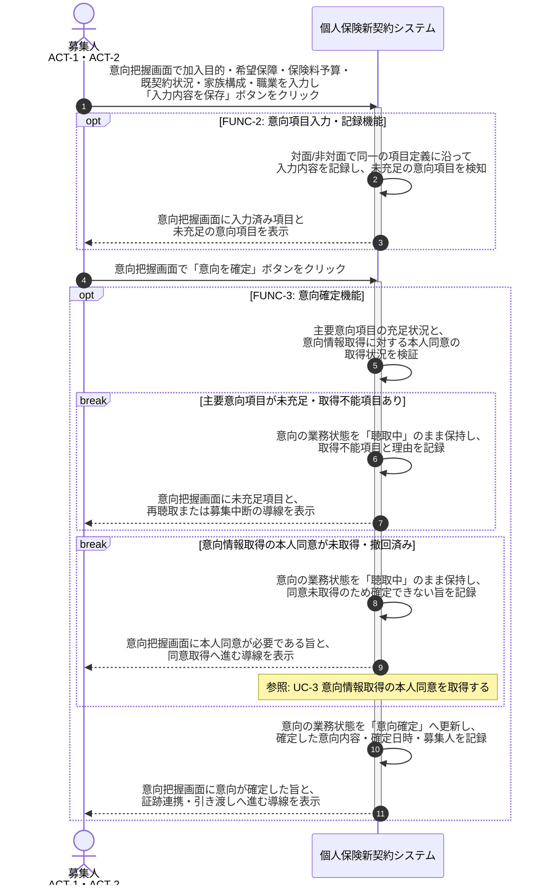

# UC-2: 意向項目を聴取・記録し意向を確定する

- **事前条件**: 意向の業務状態が「聴取中」で、募集権限が確認済み
- **事後条件**: 加入目的・希望保障・保険料予算・既契約状況・家族構成・職業の主要意向項目が網羅され、本人同意が取得済みの状態で業務状態が「意向確定」になる。未充足項目がある場合や同意が未取得の場合は「聴取中」のまま保持し、未充足項目と再聴取の導線を画面に返す

