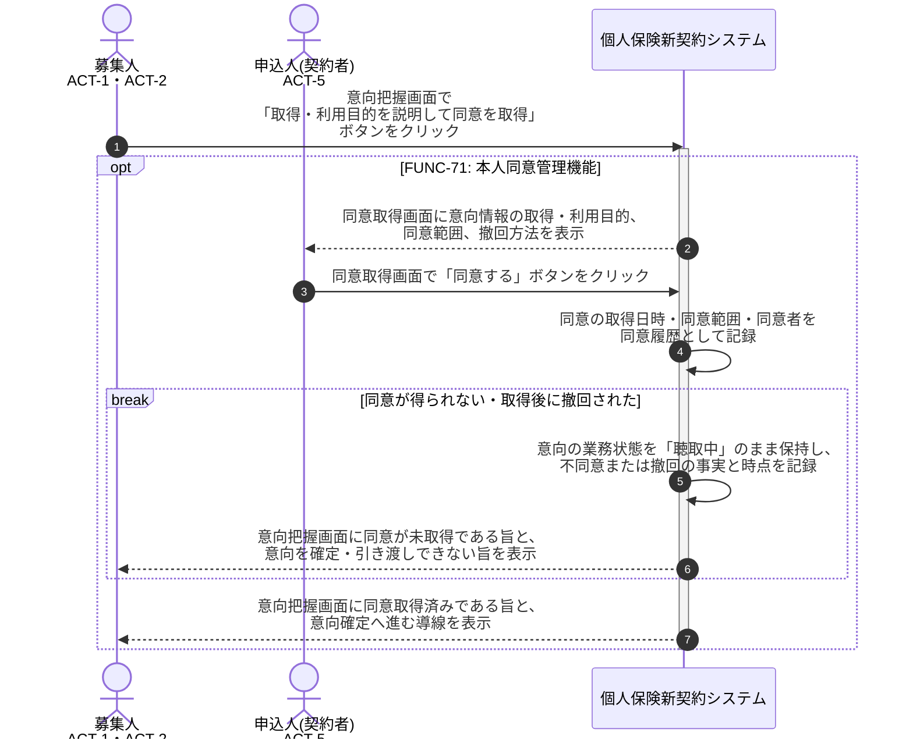

# UC-3: 意向情報取得の本人同意を取得する

- **事前条件**: 意向の業務状態が「聴取中」で、取得・利用目的を明示すべき意向情報が入力されている
- **事後条件**: 意向情報の取得・利用目的が本人に明示され、同意の取得日時・同意範囲・同意者が同意履歴として記録される。同意が得られない場合や取得後に撤回された場合は、その事実と時点を記録し、意向を確定・引き渡しできない旨を画面に返す

