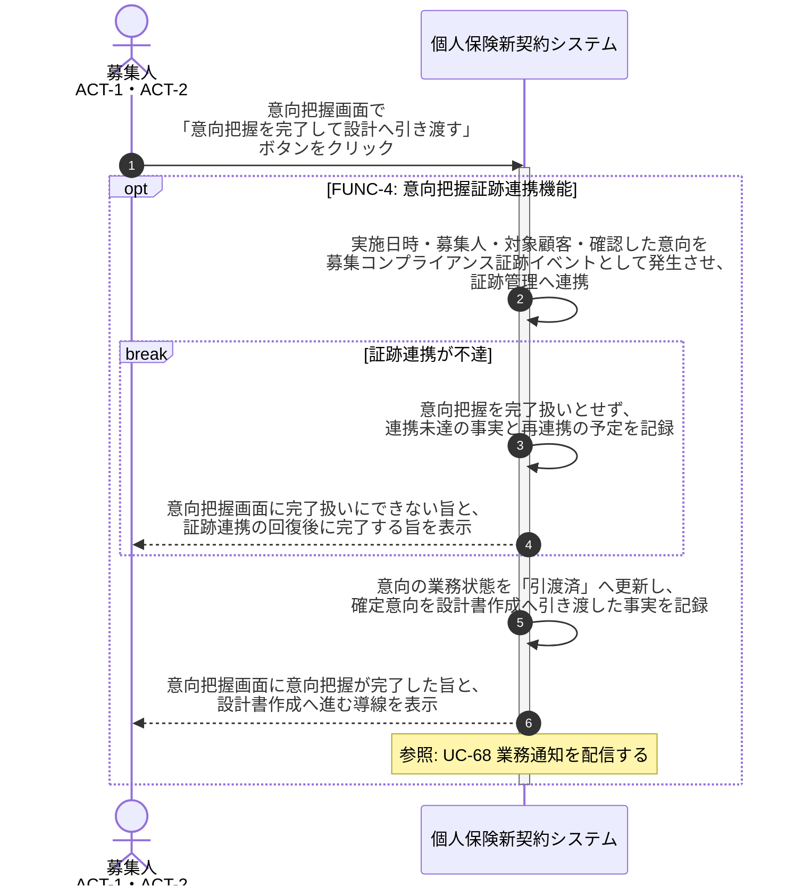

# UC-4: 意向把握の募集コンプライアンス証跡を発生・連携する

- **事前条件**: 意向の業務状態が「意向確定」で、いつ・誰が・どの顧客に対し・どの意向を確認したかが記録されている
- **事後条件**: 意向把握の実施事実が募集コンプライアンス証跡として発生し、証跡管理へ連携されたうえで業務状態が「引渡済」になる。連携が不達の場合は完了扱いとせず、再連携中である旨を画面に返す

```mermaid
sequenceDiagram
    autonumber
    actor act1_2 as 募集人<br/>ACT-1・ACT-2
    participant sys as 個人保険新契約システム

    act1_2->>sys: 意向把握画面で<br/>「意向把握を完了して設計へ引き渡す」<br/>ボタンをクリック
    activate sys

    opt FUNC-4: 意向把握証跡連携機能
        sys->>sys: 実施日時・募集人・対象顧客・確認した意向を<br/>募集コンプライアンス証跡イベントとして発生させ、<br/>証跡管理へ連携

        break 証跡連携が不達
            sys->>sys: 意向把握を完了扱いとせず、<br/>連携未達の事実と再連携の予定を記録
            sys-->>act1_2: 意向把握画面に完了扱いにできない旨と、<br/>証跡連携の回復後に完了する旨を表示
        end

        sys->>sys: 意向の業務状態を「引渡済」へ更新し、<br/>確定意向を設計書作成へ引き渡した事実を記録
        sys-->>act1_2: 意向把握画面に意向把握が完了した旨と、<br/>設計書作成へ進む導線を表示
        Note over sys: 参照: UC-68 業務通知を配信する
    end

    deactivate sys
```
