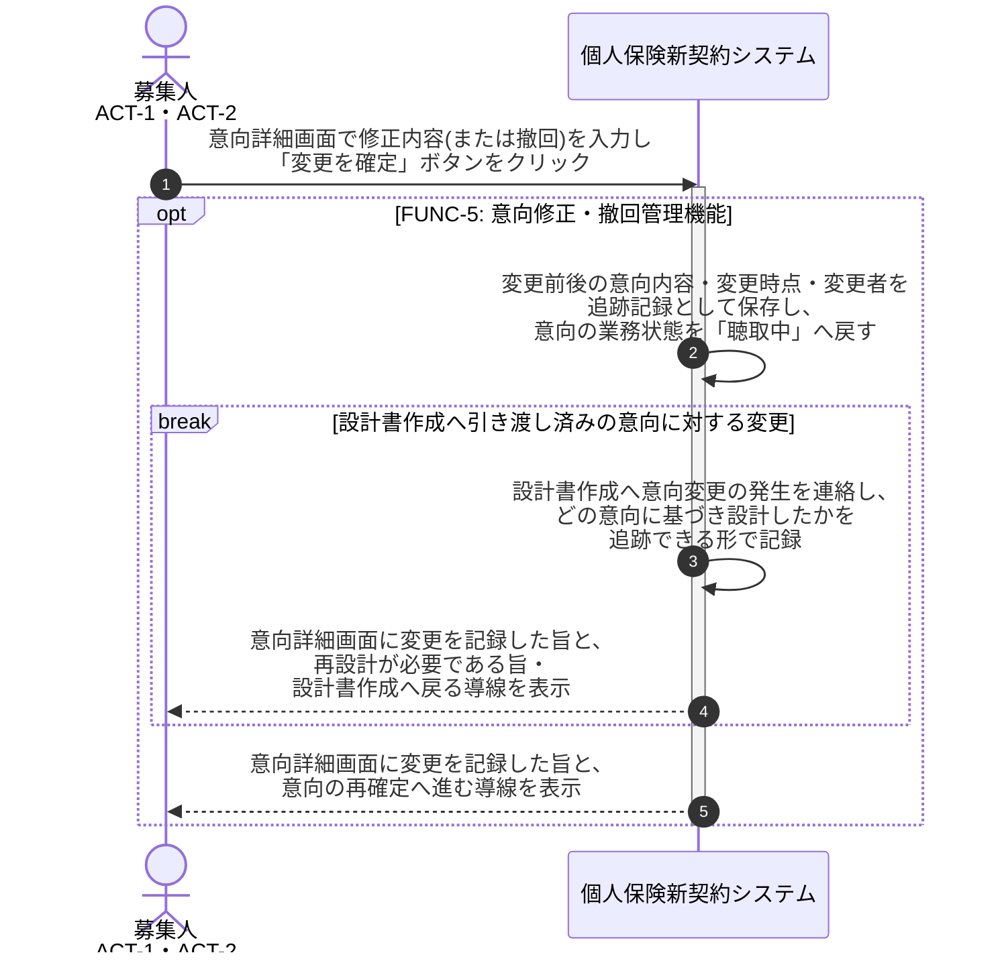

# UC-5: 確定済み意向を修正・撤回する

- **事前条件**: 意向の業務状態が「意向確定」または「引渡済」で、顧客から意向の変更・撤回の申し出がある
- **事後条件**: 変更前後の意向内容と変更時点・変更者が追跡記録として保存され、業務状態が「聴取中」へ戻る。引き渡し済みの意向を変更した場合は、設計書作成側へ再設計が必要である旨を連絡した状態になる

```mermaid
sequenceDiagram
    autonumber
    actor act1_2 as 募集人<br/>ACT-1・ACT-2
    participant sys as 個人保険新契約システム

    act1_2->>sys: 意向詳細画面で修正内容(または撤回)を入力し<br/>「変更を確定」ボタンをクリック
    activate sys

    opt FUNC-5: 意向修正・撤回管理機能
        sys->>sys: 変更前後の意向内容・変更時点・変更者を<br/>追跡記録として保存し、<br/>意向の業務状態を「聴取中」へ戻す

        break 設計書作成へ引き渡し済みの意向に対する変更
            sys->>sys: 設計書作成へ意向変更の発生を連絡し、<br/>どの意向に基づき設計したかを<br/>追跡できる形で記録
            sys-->>act1_2: 意向詳細画面に変更を記録した旨と、<br/>再設計が必要である旨・<br/>設計書作成へ戻る導線を表示
        end

        sys-->>act1_2: 意向詳細画面に変更を記録した旨と、<br/>意向の再確定へ進む導線を表示
    end

    deactivate sys
```
