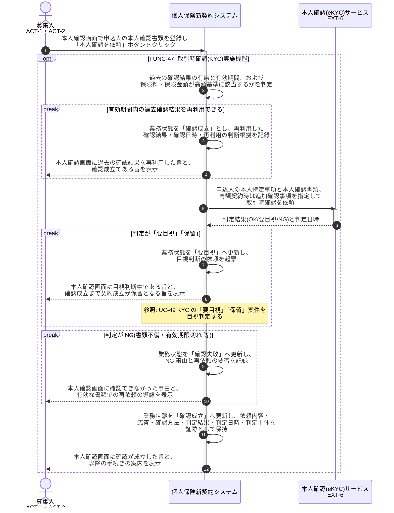

# UC-47: 取引時確認(本人特定事項)を外部サービス連携で実施する

- **事前条件**: 申込受付時に取引時確認の必要性が検知され、業務状態が「未依頼」。過去の確認結果がある場合はその有効期間が参照可能
- **事後条件**: 外部本人確認サービスの判定に依拠して業務状態が「確認成立」になる。判定が保留の場合は「要目視」、NG の場合は「確認失敗」として再依頼へ回す。有効期間内の過去結果は再利用し、高額契約は厳格な確認を要求した状態で確認を取り直す

