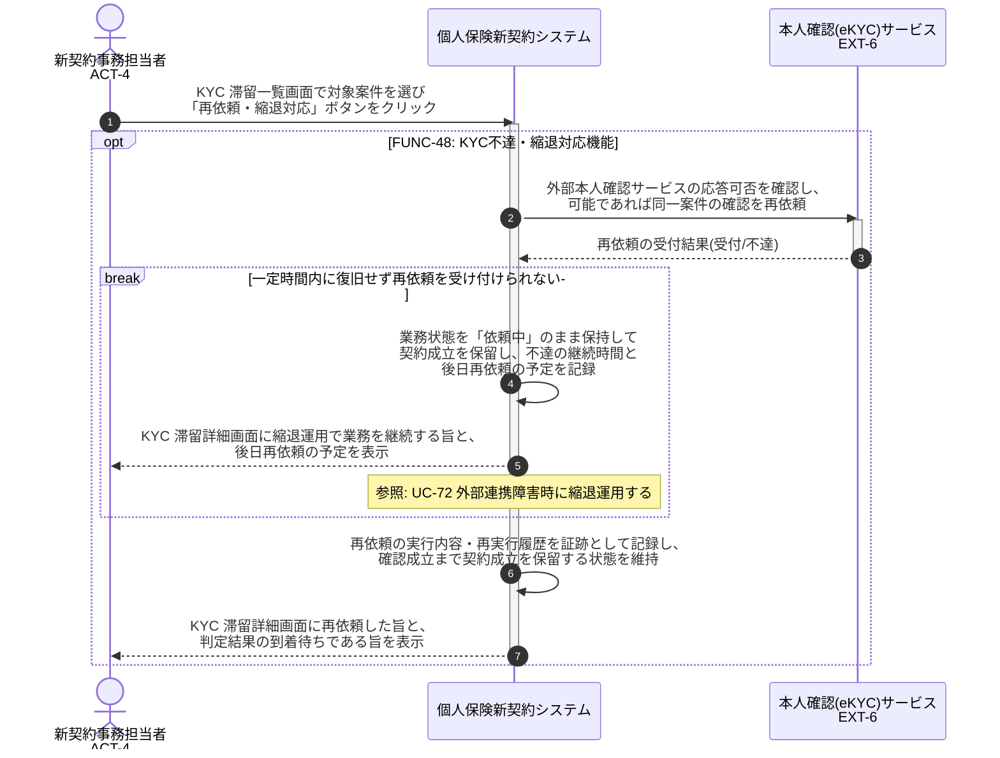

# UC-48: KYC の外部不達・タイムアウト時に再依頼・縮退運用で業務継続する

- **事前条件**: 外部本人確認サービスの不達・タイムアウト・応答遅延が発生し、業務状態が「依頼中」のまま滞留している
- **事後条件**: 業務上の再依頼手順により確認が再実行されるか、一定時間内に復旧しない場合は申込人へ業務通知のうえ後日再依頼として縮退運用で業務が継続された状態になる。いずれの場合も契約成立は確認成立まで保留する

