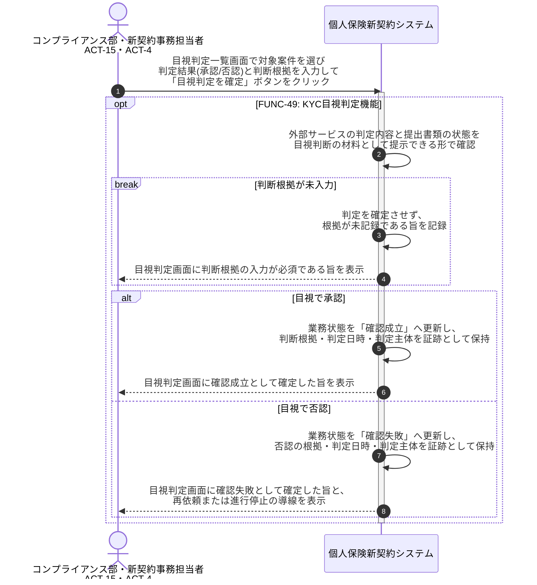

# UC-49: KYC の「要目視」「保留」案件を目視判定する

- **事前条件**: 外部本人確認サービスから「要目視」「保留」の応答があり、業務状態が「要目視」で目視判断の依頼が起票されている
- **事後条件**: 業務担当者の目視判断により業務状態が「確認成立」または「確認失敗」に確定し、目視判断の根拠と結果が証跡として保持された状態になる。目視完了までは確認成立扱いとしない

```mermaid
sequenceDiagram
    autonumber
    actor act15_4 as コンプライアンス部・新契約事務担当者<br/>ACT-15・ACT-4
    participant sys as 個人保険新契約システム

    act15_4->>sys: 目視判定一覧画面で対象案件を選び<br/>判定結果(承認/否認)と判断根拠を入力して<br/>「目視判定を確定」ボタンをクリック
    activate sys

    opt FUNC-49: KYC目視判定機能
        sys->>sys: 外部サービスの判定内容と提出書類の状態を<br/>目視判断の材料として提示できる形で確認

        break 判断根拠が未入力
            sys->>sys: 判定を確定させず、<br/>根拠が未記録である旨を記録
            sys-->>act15_4: 目視判定画面に判断根拠の入力が必須である旨を表示
        end

        alt 目視で承認
            sys->>sys: 業務状態を「確認成立」へ更新し、<br/>判断根拠・判定日時・判定主体を証跡として保持
            sys-->>act15_4: 目視判定画面に確認成立として確定した旨を表示
        else 目視で否認
            sys->>sys: 業務状態を「確認失敗」へ更新し、<br/>否認の根拠・判定日時・判定主体を証跡として保持
            sys-->>act15_4: 目視判定画面に確認失敗として確定した旨と、<br/>再依頼または進行停止の導線を表示
        end
    end

    deactivate sys
```
