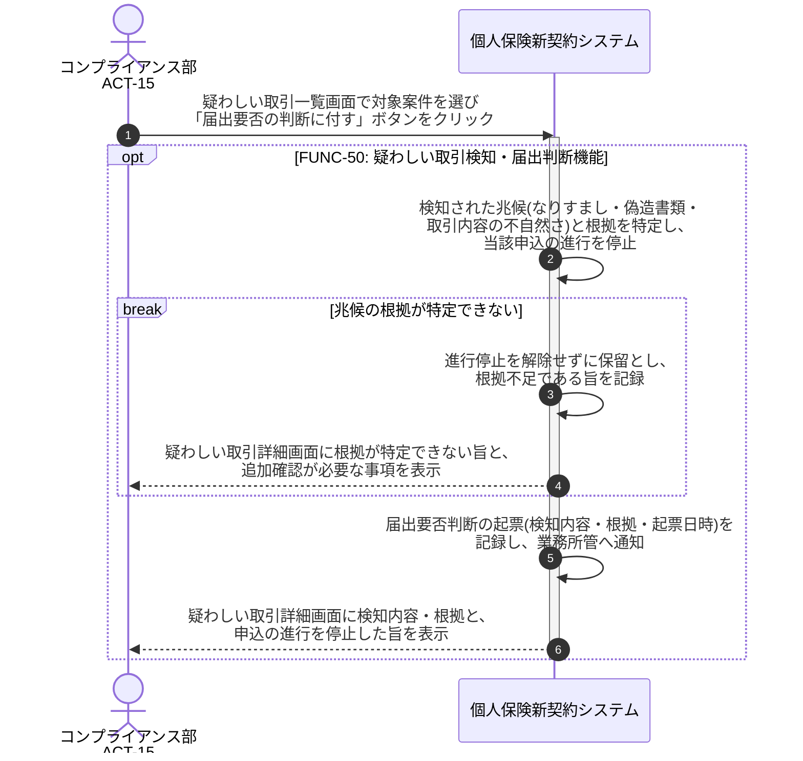

# UC-50: 疑わしい取引の兆候を検知し届出要否判断に付す

- **事前条件**: 外部本人確認サービスの判定または業務担当者の目視判断で、なりすまし・偽造書類・取引内容の不自然さ 等の兆候が検知されている
- **事後条件**: 兆候の内容が業務所管へ通知されて疑わしい取引の届出要否判断に付され、当該申込の進行が停止された状態になる。検知内容と判断の経緯が証跡として保持される

```mermaid
sequenceDiagram
    autonumber
    actor act15 as コンプライアンス部<br/>ACT-15
    participant sys as 個人保険新契約システム

    act15->>sys: 疑わしい取引一覧画面で対象案件を選び<br/>「届出要否の判断に付す」ボタンをクリック
    activate sys

    opt FUNC-50: 疑わしい取引検知・届出判断機能
        sys->>sys: 検知された兆候(なりすまし・偽造書類・<br/>取引内容の不自然さ)と根拠を特定し、<br/>当該申込の進行を停止

        break 兆候の根拠が特定できない
            sys->>sys: 進行停止を解除せずに保留とし、<br/>根拠不足である旨を記録
            sys-->>act15: 疑わしい取引詳細画面に根拠が特定できない旨と、<br/>追加確認が必要な事項を表示
        end

        sys->>sys: 届出要否判断の起票(検知内容・根拠・起票日時)を<br/>記録し、業務所管へ通知
        sys-->>act15: 疑わしい取引詳細画面に検知内容・根拠と、<br/>申込の進行を停止した旨を表示
    end

    deactivate sys
```
