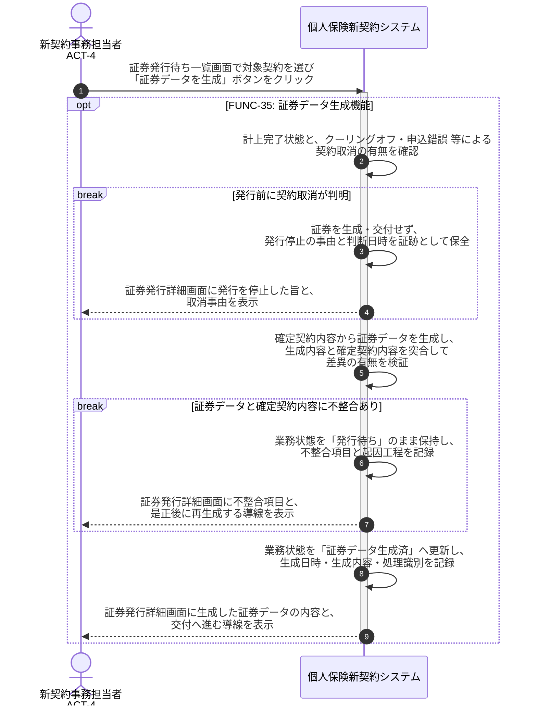

# UC-35: 証券データを確定契約内容と差異なく生成する

- **事前条件**: 計上完了済みの契約が業務状態「発行待ち」で到着し、確定契約内容(契約者・被保険者・受取人・プラン・保険金額・保険料・払込方法・責任開始日・特別条件)が参照可能
- **事後条件**: 確定契約内容と差異のない証券データが生成され、業務状態が「証券データ生成済」になる。契約内容との不整合を検知した場合、または発行前に契約取消が判明した場合は発行・交付せず、是正または発行停止の証跡を保全する

