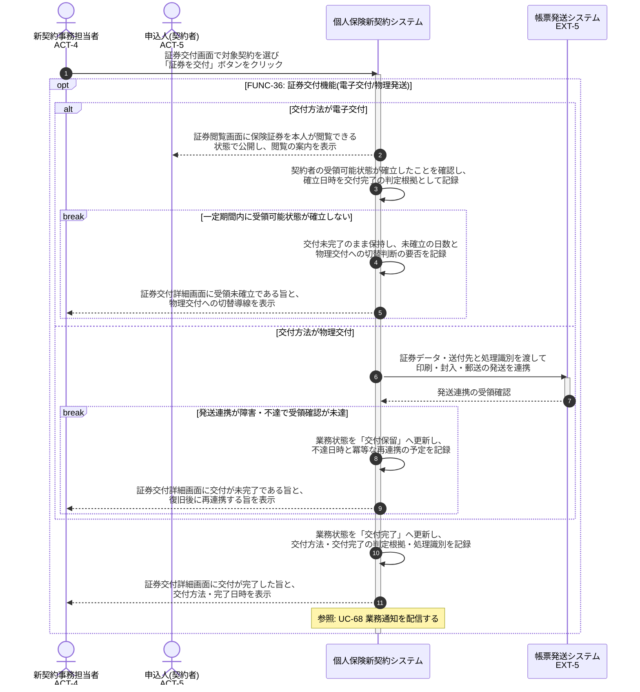

# UC-36: 保険証券を交付する(電子交付/物理発送)

- **事前条件**: 業務状態が「証券データ生成済」で、契約者の選択・同意・チャネル・商品条件に基づく交付方法(電子交付/物理交付)が確定している
- **事後条件**: 電子交付は契約者の受領可能状態の確立をもって、物理交付は既存帳票発送システムへの発送連携の受領確認をもって業務状態が「交付完了」になる。発送連携依頼のみでは交付完了とせず、連携障害時は「交付保留」として復旧後に冪等に再連携する

