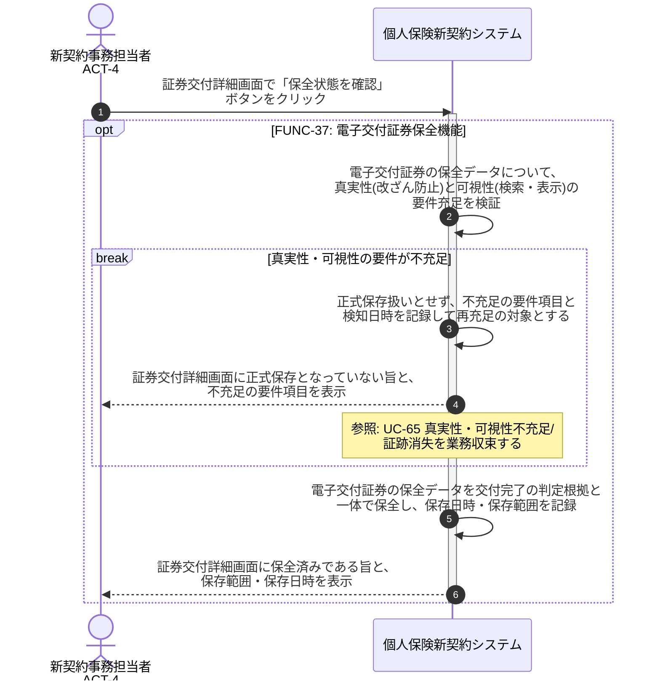

# UC-37: 電子交付証券の保全データを保有する

- **事前条件**: 電子交付の交付完了が確定し、交付完了の判定根拠(受領可能状態の確立日時)が記録されている
- **事後条件**: 電子交付証券の保全データが電子帳簿保存法に整合する形(真実性・可視性の要件を満たす形)で管理され、交付完了の判定根拠と一体で保全された状態になる。要件を満たさない場合は正式保存扱いとせず再充足する

```mermaid
sequenceDiagram
    autonumber
    actor act4 as 新契約事務担当者<br/>ACT-4
    participant sys as 個人保険新契約システム

    act4->>sys: 証券交付詳細画面で「保全状態を確認」<br/>ボタンをクリック
    activate sys

    opt FUNC-37: 電子交付証券保全機能
        sys->>sys: 電子交付証券の保全データについて、<br/>真実性(改ざん防止)と可視性(検索・表示)の<br/>要件充足を検証

        break 真実性・可視性の要件が不充足
            sys->>sys: 正式保存扱いとせず、不充足の要件項目と<br/>検知日時を記録して再充足の対象とする
            sys-->>act4: 証券交付詳細画面に正式保存となっていない旨と、<br/>不充足の要件項目を表示
            Note over sys: 参照: UC-65 真実性・可視性不充足/<br/>証跡消失を業務収束する
        end

        sys->>sys: 電子交付証券の保全データを交付完了の判定根拠と<br/>一体で保全し、保存日時・保存範囲を記録
        sys-->>act4: 証券交付詳細画面に保全済みである旨と、<br/>保存範囲・保存日時を表示
    end

    deactivate sys
```
