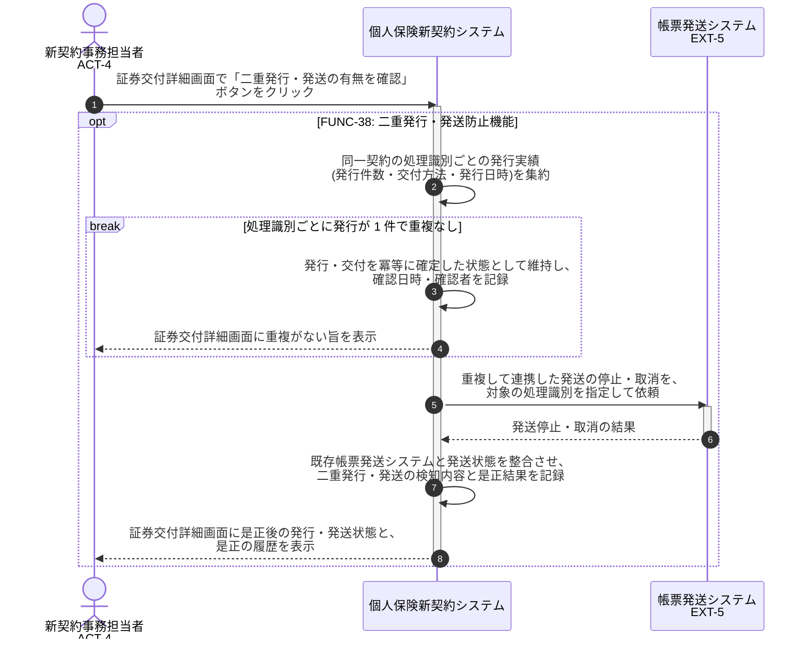

# UC-38: 二重発行・二重発送を冪等に防止する

- **事前条件**: リトライ・連携再送・再実行により同一契約の証券発行または発送が重複した疑いがある
- **事後条件**: 処理識別により同一契約の発行・交付が 1 回限りに冪等確定し、二重交付が判明した場合は既存帳票発送システムと整合させて是正され、是正の事由と履歴が記録された状態になる

```mermaid
sequenceDiagram
    autonumber
    actor act4 as 新契約事務担当者<br/>ACT-4
    participant sys as 個人保険新契約システム
    participant ext5 as 帳票発送システム<br/>EXT-5

    act4->>sys: 証券交付詳細画面で「二重発行・発送の有無を確認」<br/>ボタンをクリック
    activate sys

    opt FUNC-38: 二重発行・発送防止機能
        sys->>sys: 同一契約の処理識別ごとの発行実績<br/>(発行件数・交付方法・発行日時)を集約

        break 処理識別ごとに発行が 1 件で重複なし
            sys->>sys: 発行・交付を冪等に確定した状態として維持し、<br/>確認日時・確認者を記録
            sys-->>act4: 証券交付詳細画面に重複がない旨を表示
        end

        sys->>ext5: 重複して連携した発送の停止・取消を、<br/>対象の処理識別を指定して依頼
        activate ext5
        ext5-->>sys: 発送停止・取消の結果
        deactivate ext5

        sys->>sys: 既存帳票発送システムと発送状態を整合させ、<br/>二重発行・発送の検知内容と是正結果を記録
        sys-->>act4: 証券交付詳細画面に是正後の発行・発送状態と、<br/>是正の履歴を表示
    end

    deactivate sys
```
