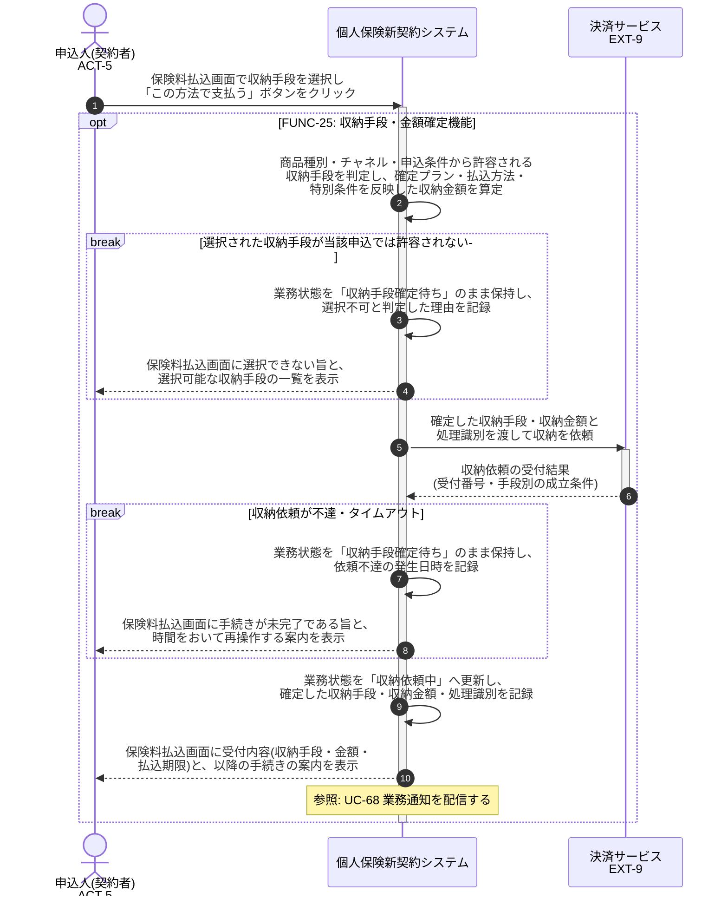

# UC-25: 収納手段・収納金額を確定する

- **事前条件**: 申込受付から収納依頼が到着し、業務状態が「収納手段確定待ち」。引受査定で特別条件が付与されている場合は条件反映後の金額が参照可能
- **事後条件**: 商品種別・チャネル・申込条件で許容される収納手段(口座振替・クレジットカード・振込・コンビニ払込・現金)と確定金額が定まり、業務状態が「収納依頼中」になる。許容されない手段が選択された場合は確定せず、選択可能な手段を画面に返す

