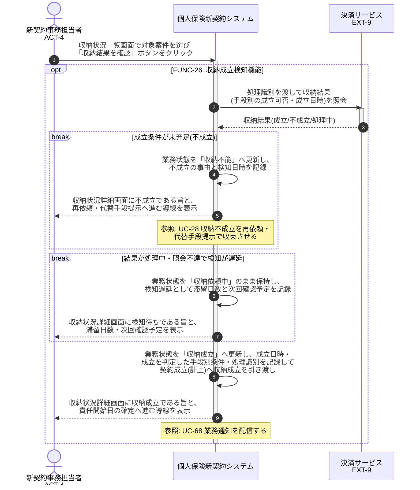

# UC-26: 収納成立を手段別成立条件で検知する

- **事前条件**: 業務状態が「収納依頼中」で、収納手段ごとの成立条件(口座振替=引落確定、カード=売上確定、振込=入金消込、コンビニ=収納消込、現金=受領確認)が定まっている
- **事後条件**: 手段別の成立条件の充足が検知され、業務状態が「収納成立」となって契約成立条件の一方を充足した情報が契約成立(計上)へ引き渡される。成立が検知できない場合は収納不能として収束処理へ回し、検知遅延は滞留として業務監視の対象にする

