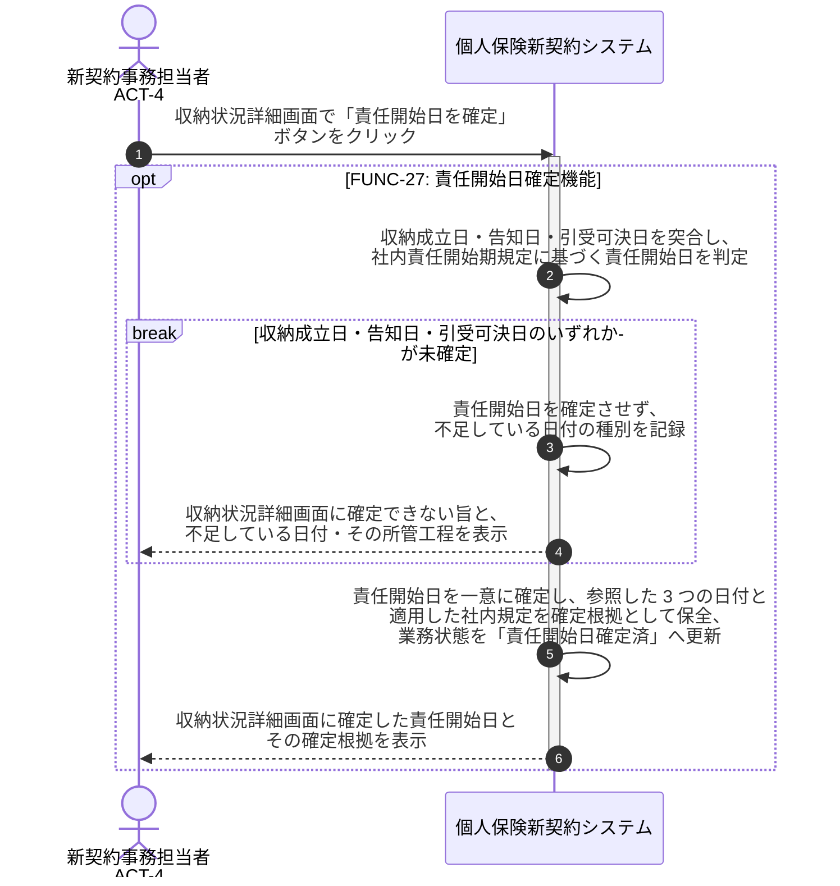

# UC-27: 責任開始日を確定する

- **事前条件**: 収納成立日・告知日・引受可決日が揃い、業務状態が「収納成立」
- **事後条件**: 社内責任開始期規定に基づき責任開始日が一意に確定し、確定根拠(参照した 3 つの日付と適用規定)とともに保全されて業務状態が「責任開始日確定済」になる。いずれかの日付が未確定の場合は確定せず、不足している日付を画面に返す

```mermaid
sequenceDiagram
    autonumber
    actor act4 as 新契約事務担当者<br/>ACT-4
    participant sys as 個人保険新契約システム

    act4->>sys: 収納状況詳細画面で「責任開始日を確定」<br/>ボタンをクリック
    activate sys

    opt FUNC-27: 責任開始日確定機能
        sys->>sys: 収納成立日・告知日・引受可決日を突合し、<br/>社内責任開始期規定に基づく責任開始日を判定

        break 収納成立日・告知日・引受可決日のいずれかが未確定
            sys->>sys: 責任開始日を確定させず、<br/>不足している日付の種別を記録
            sys-->>act4: 収納状況詳細画面に確定できない旨と、<br/>不足している日付・その所管工程を表示
        end

        sys->>sys: 責任開始日を一意に確定し、参照した 3 つの日付と<br/>適用した社内規定を確定根拠として保全、<br/>業務状態を「責任開始日確定済」へ更新
        sys-->>act4: 収納状況詳細画面に確定した責任開始日と<br/>その確定根拠を表示
    end

    deactivate sys
```
