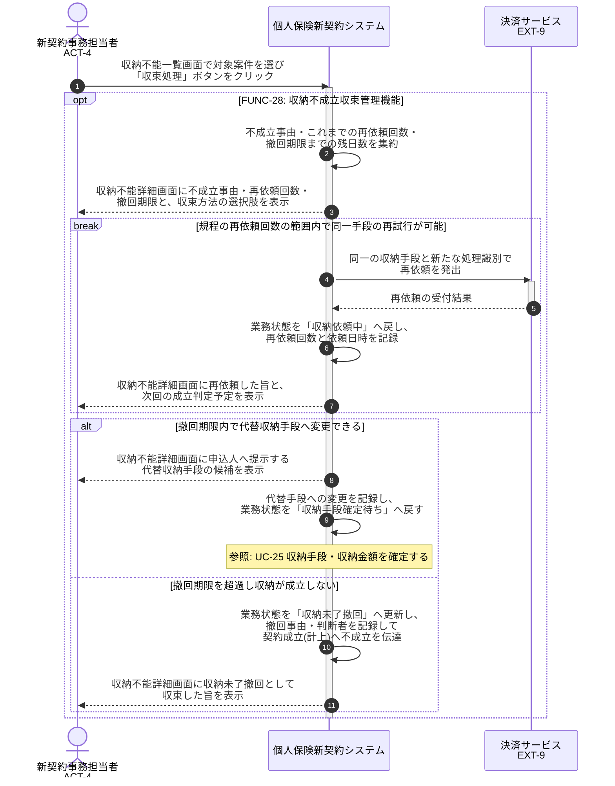

# UC-28: 収納不成立を再依頼・代替手段提示で収束させる

- **事前条件**: 業務状態が「収納不能」で、収納手段ごとの社内収納規程が定める再依頼回数・撤回期限が参照可能
- **事後条件**: 規程の範囲内で再依頼または代替手段による再試行が行われ業務状態が「収納依頼中」へ戻るか、期限内に成立しない場合は「収納未了撤回」として収束し、契約成立(計上)へ不成立が伝達された状態になる

