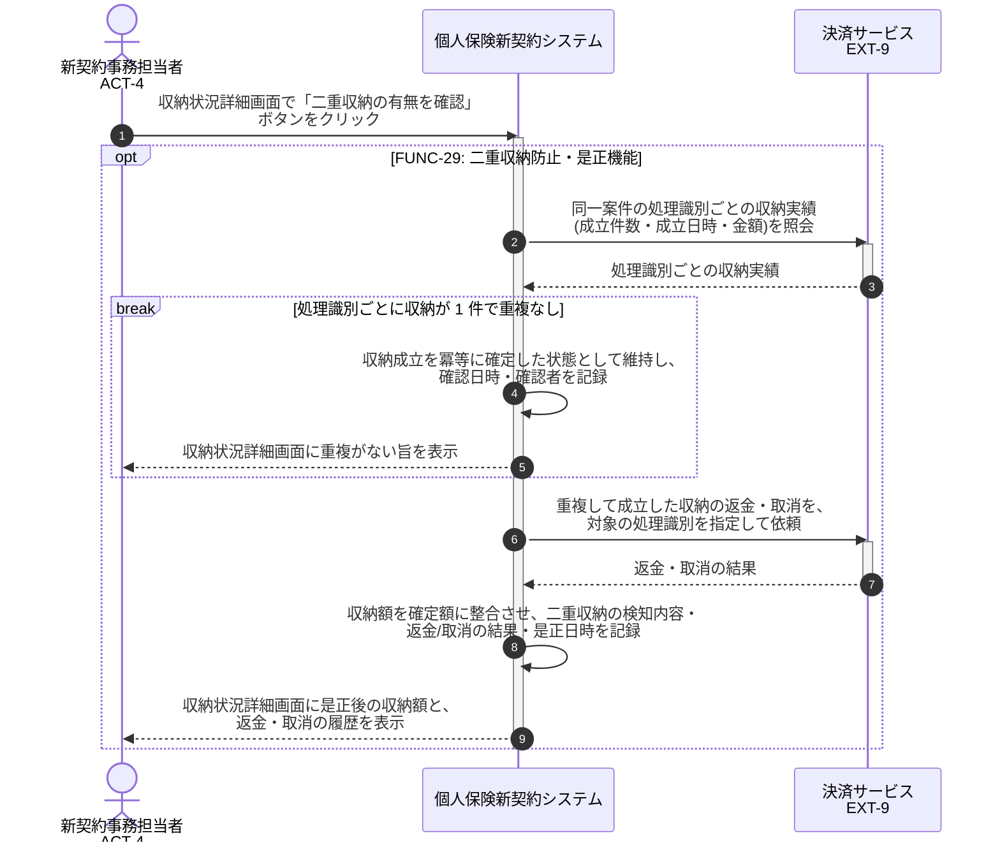

# UC-29: 二重収納を冪等に防止・是正する

- **事前条件**: 再依頼・連携再送と実収納の重複により二重収納の疑いが検知されている
- **事後条件**: 処理識別により収納成立が 1 回限りに冪等確定し、二重収納が判明した場合は返金・取消により整合した収納額へ是正され、是正の事由と履歴が記録された状態になる

```mermaid
sequenceDiagram
    autonumber
    actor act4 as 新契約事務担当者<br/>ACT-4
    participant sys as 個人保険新契約システム
    participant ext9 as 決済サービス<br/>EXT-9

    act4->>sys: 収納状況詳細画面で「二重収納の有無を確認」<br/>ボタンをクリック
    activate sys

    opt FUNC-29: 二重収納防止・是正機能
        sys->>ext9: 同一案件の処理識別ごとの収納実績<br/>(成立件数・成立日時・金額)を照会
        activate ext9
        ext9-->>sys: 処理識別ごとの収納実績
        deactivate ext9

        break 処理識別ごとに収納が 1 件で重複なし
            sys->>sys: 収納成立を冪等に確定した状態として維持し、<br/>確認日時・確認者を記録
            sys-->>act4: 収納状況詳細画面に重複がない旨を表示
        end

        sys->>ext9: 重複して成立した収納の返金・取消を、<br/>対象の処理識別を指定して依頼
        activate ext9
        ext9-->>sys: 返金・取消の結果
        deactivate ext9

        sys->>sys: 収納額を確定額に整合させ、二重収納の検知内容・<br/>返金/取消の結果・是正日時を記録
        sys-->>act4: 収納状況詳細画面に是正後の収納額と、<br/>返金・取消の履歴を表示
    end

    deactivate sys
```
