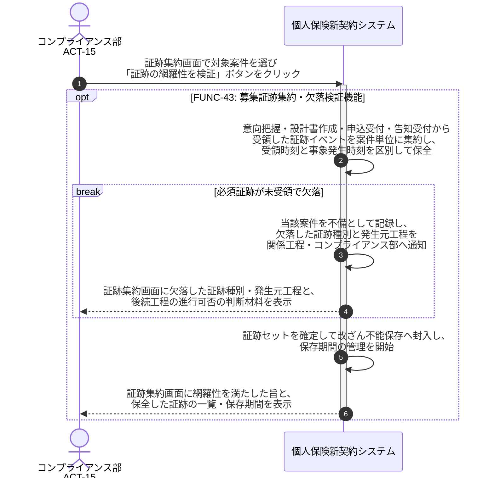

# UC-43: 募集コンプライアンス証跡を網羅集約し欠落を検証する

- **事前条件**: 意向把握・設計書作成・申込受付・告知受付の各工程から証跡イベントが到達しており、案件単位で必須証跡の定義が参照可能
- **事後条件**: 案件単位で必須証跡の網羅性が検証され、欠落がなければ証跡セットが確定・保全された状態になる。欠落を検知した場合は当該案件を不備として扱い関係工程・コンプライアンス部へ通知する。遅延到達は欠落扱いとせず、受領時刻と事象発生時刻を区別して保全する

