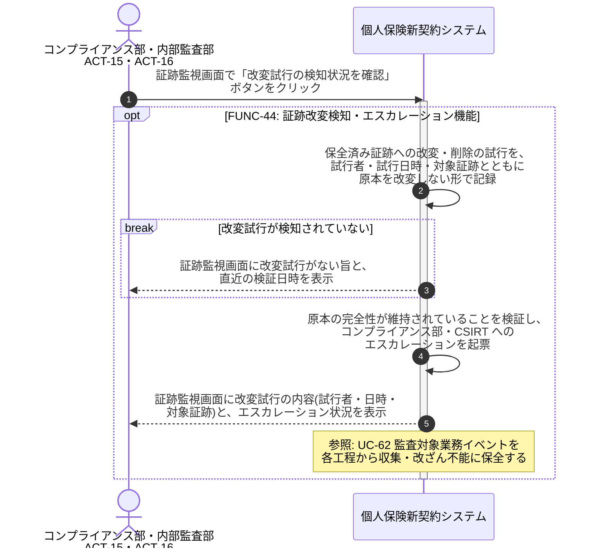

# UC-44: 保全済み証跡への改変試行を検知しエスカレーションする

- **事前条件**: 証跡が改ざん不能保存に封入されており、保全済み証跡への改変・削除の試行が発生しうる状態
- **事後条件**: 改変試行が追跡可能な形で記録されて原本の完全性が維持され、コンプライアンス部・CSIRT へエスカレーションされた状態になる

```mermaid
sequenceDiagram
    autonumber
    actor act15_16 as コンプライアンス部・内部監査部<br/>ACT-15・ACT-16
    participant sys as 個人保険新契約システム

    act15_16->>sys: 証跡監視画面で「改変試行の検知状況を確認」<br/>ボタンをクリック
    activate sys

    opt FUNC-44: 証跡改変検知・エスカレーション機能
        sys->>sys: 保全済み証跡への改変・削除の試行を、<br/>試行者・試行日時・対象証跡とともに<br/>原本を改変しない形で記録

        break 改変試行が検知されていない
            sys-->>act15_16: 証跡監視画面に改変試行がない旨と、<br/>直近の検証日時を表示
        end

        sys->>sys: 原本の完全性が維持されていることを検証し、<br/>コンプライアンス部・CSIRT への<br/>エスカレーションを起票
        sys-->>act15_16: 証跡監視画面に改変試行の内容(試行者・日時・<br/>対象証跡)と、エスカレーション状況を表示
        Note over sys: 参照: UC-62 監査対象業務イベントを<br/>各工程から収集・改ざん不能に保全する
    end

    deactivate sys
```
