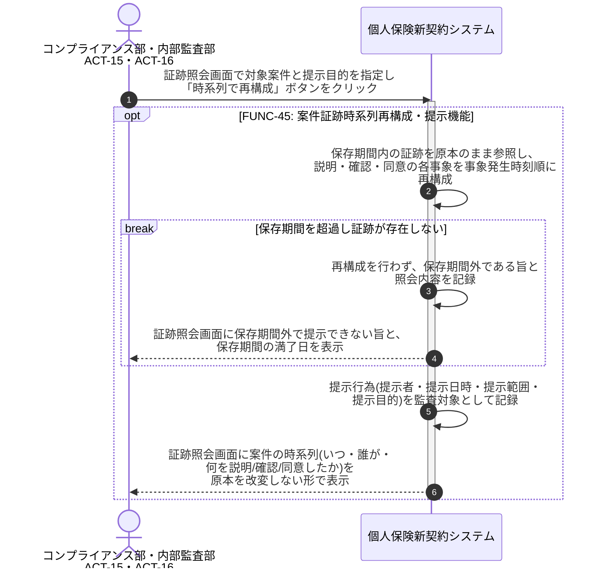

# UC-45: 案件証跡を時系列再構成・提示する

- **事前条件**: 監督官庁要請・コンプライアンスレビュー・内部監査要請により、保存期間内の案件について証跡の提示が求められている
- **事後条件**: 案件単位で「いつ・誰が・何を説明/確認/同意したか」が原本を改変せずに時系列再構成されて提示され、提示行為自体も監査対象として記録された状態になる

```mermaid
sequenceDiagram
    autonumber
    actor act15_16 as コンプライアンス部・内部監査部<br/>ACT-15・ACT-16
    participant sys as 個人保険新契約システム

    act15_16->>sys: 証跡照会画面で対象案件と提示目的を指定し<br/>「時系列で再構成」ボタンをクリック
    activate sys

    opt FUNC-45: 案件証跡時系列再構成・提示機能
        sys->>sys: 保存期間内の証跡を原本のまま参照し、<br/>説明・確認・同意の各事象を事象発生時刻順に<br/>再構成

        break 保存期間を超過し証跡が存在しない
            sys->>sys: 再構成を行わず、保存期間外である旨と<br/>照会内容を記録
            sys-->>act15_16: 証跡照会画面に保存期間外で提示できない旨と、<br/>保存期間の満了日を表示
        end

        sys->>sys: 提示行為(提示者・提示日時・提示範囲・<br/>提示目的)を監査対象として記録
        sys-->>act15_16: 証跡照会画面に案件の時系列(いつ・誰が・<br/>何を説明/確認/同意したか)を<br/>原本を改変しない形で表示
    end

    deactivate sys
```
