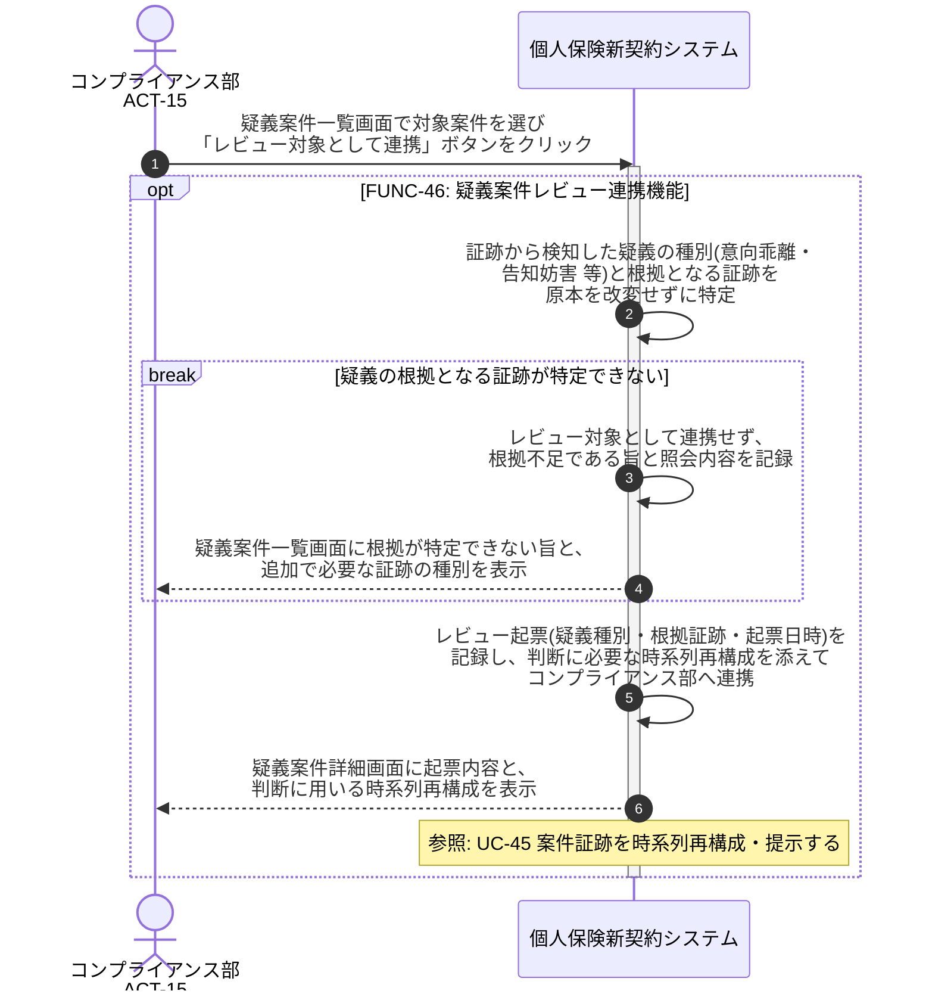

# UC-46: 疑義案件をレビュー対象として連携する

- **事前条件**: 保全済み証跡から意向乖離・告知妨害 等の疑義が検知されている
- **事後条件**: 疑義案件が原本を改変しない形でコンプライアンス部のレビュー対象として連携され、判断に必要な再構成が提供された状態になる。契約成立に至らなかった案件の証跡も保全対象として維持される

```mermaid
sequenceDiagram
    autonumber
    actor act15 as コンプライアンス部<br/>ACT-15
    participant sys as 個人保険新契約システム

    act15->>sys: 疑義案件一覧画面で対象案件を選び<br/>「レビュー対象として連携」ボタンをクリック
    activate sys

    opt FUNC-46: 疑義案件レビュー連携機能
        sys->>sys: 証跡から検知した疑義の種別(意向乖離・<br/>告知妨害 等)と根拠となる証跡を<br/>原本を改変せずに特定

        break 疑義の根拠となる証跡が特定できない
            sys->>sys: レビュー対象として連携せず、<br/>根拠不足である旨と照会内容を記録
            sys-->>act15: 疑義案件一覧画面に根拠が特定できない旨と、<br/>追加で必要な証跡の種別を表示
        end

        sys->>sys: レビュー起票(疑義種別・根拠証跡・起票日時)を<br/>記録し、判断に必要な時系列再構成を添えて<br/>コンプライアンス部へ連携
        sys-->>act15: 疑義案件詳細画面に起票内容と、<br/>判断に用いる時系列再構成を表示
        Note over sys: 参照: UC-45 案件証跡を時系列再構成・提示する
    end

    deactivate sys
```
