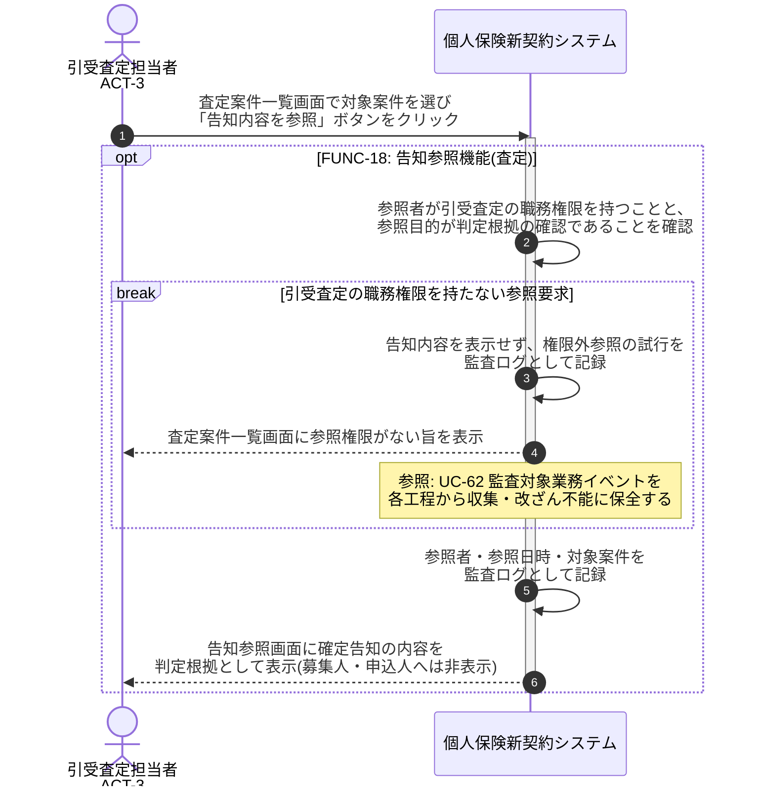

# UC-18: 告知情報を引受査定の根拠として参照する

- **事前条件**: 告知が確定し引受査定へ引き渡されており、査定対象案件が査定受付の状態にある
- **事後条件**: 引受査定の職務権限を持つ担当者にのみ確定告知の内容が判定根拠として表示され、参照の実施が監査ログとして記録される。権限を持たない参照要求には告知内容を表示せず、権限外参照の試行を記録する

```mermaid
sequenceDiagram
    autonumber
    actor act3 as 引受査定担当者<br/>ACT-3
    participant sys as 個人保険新契約システム

    act3->>sys: 査定案件一覧画面で対象案件を選び<br/>「告知内容を参照」ボタンをクリック
    activate sys

    opt FUNC-18: 告知参照機能(査定)
        sys->>sys: 参照者が引受査定の職務権限を持つことと、<br/>参照目的が判定根拠の確認であることを確認

        break 引受査定の職務権限を持たない参照要求
            sys->>sys: 告知内容を表示せず、権限外参照の試行を<br/>監査ログとして記録
            sys-->>act3: 査定案件一覧画面に参照権限がない旨を表示
            Note over sys: 参照: UC-62 監査対象業務イベントを<br/>各工程から収集・改ざん不能に保全する
        end

        sys->>sys: 参照者・参照日時・対象案件を<br/>監査ログとして記録
        sys-->>act3: 告知参照画面に確定告知の内容を<br/>判定根拠として表示(募集人・申込人へは非表示)
    end

    deactivate sys
```
