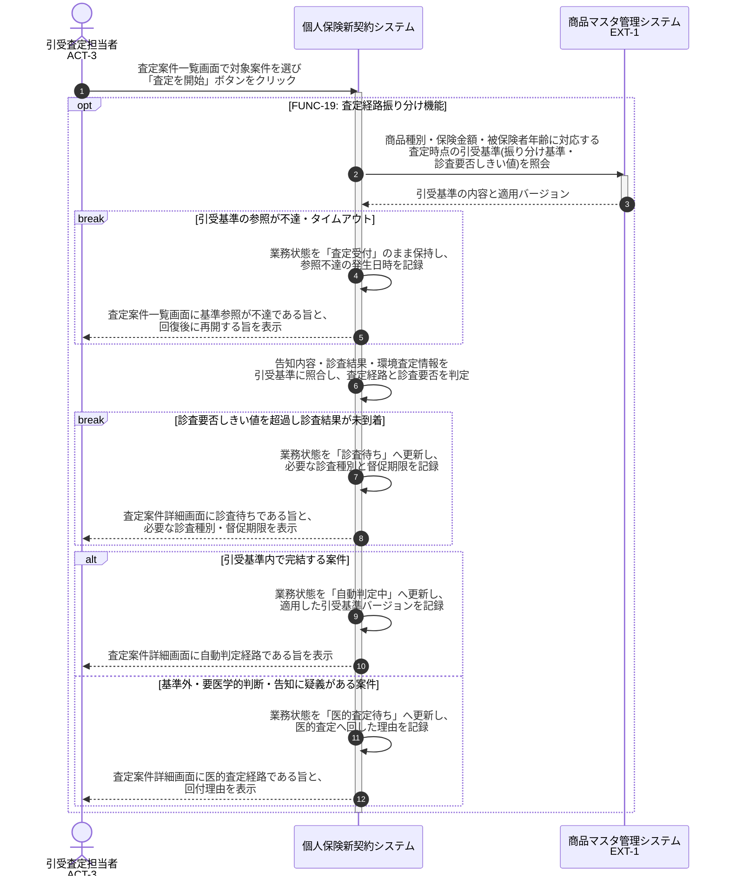

# UC-19: 査定経路を振り分ける(自動/医的)

- **事前条件**: 告知が確定して査定対象が到着し、業務状態が「査定受付」で、必要な診査結果・環境査定情報が参照可能
- **事後条件**: 引受基準に照合した結果、基準内で完結する案件は「自動判定中」へ、基準外・要医学的判断・告知に疑義がある案件は「医的査定待ち」へ振り分けられ、診査が必要な案件は診査結果が揃うまで確定しない状態になる

