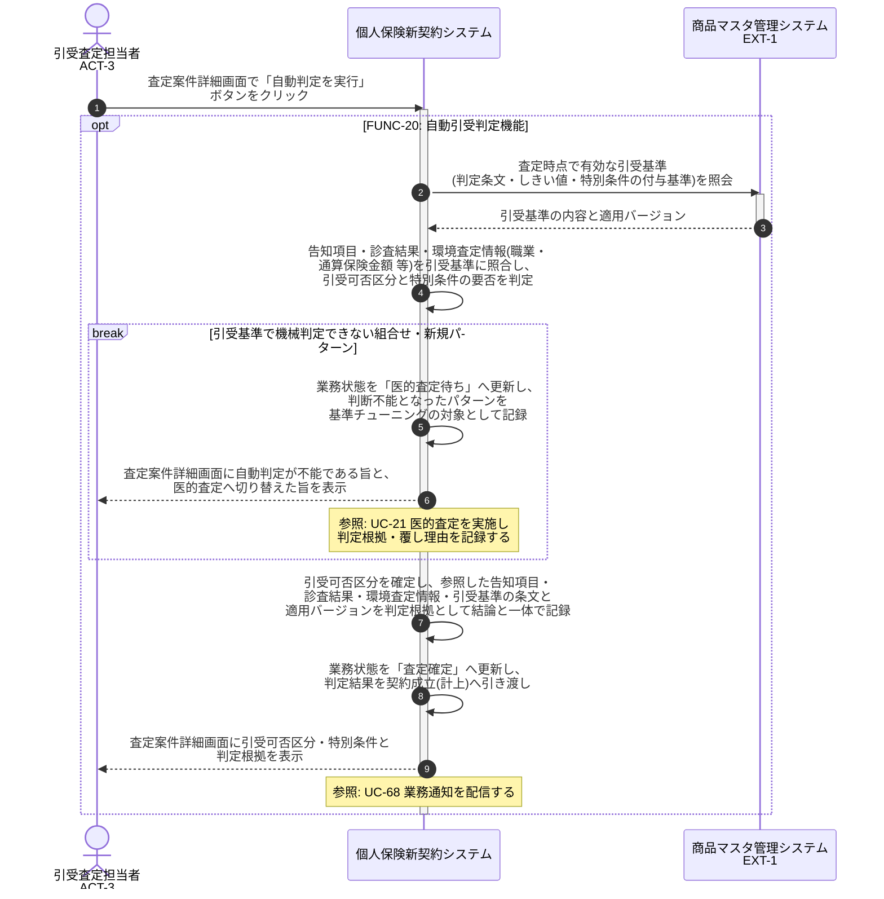

# UC-20: 自動判定を実行し判定根拠を記録する

- **事前条件**: 業務状態が「自動判定中」で、判定に必要な告知内容・診査結果・環境査定情報が揃っている
- **事後条件**: 引受可否が「可決(無条件)」「特別条件付き可決」「謝絶」「保留(追加情報待ち)」のいずれかに確定し、適用した引受基準バージョンと判定根拠が結論と一体で記録される。機械判定できない組合せの場合は「医的査定待ち」へ切り替える

