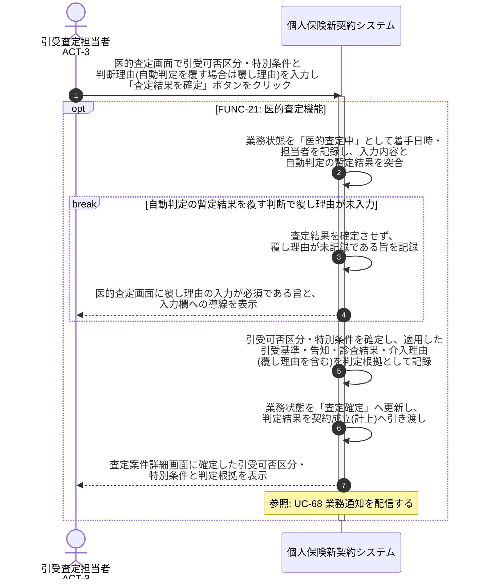

# UC-21: 医的査定を実施し判定根拠・覆し理由を記録する

- **事前条件**: 業務状態が「医的査定待ち」で、告知内容・診査結果・環境査定情報と自動判定の暫定結果が参照可能
- **事後条件**: 引受査定担当者の判断で引受可否区分と特別条件が確定し、適用した引受基準・告知・診査結果・介入理由が判定根拠として記録される。自動判定の暫定結果を覆した場合は覆し理由が必須記録された状態になる

