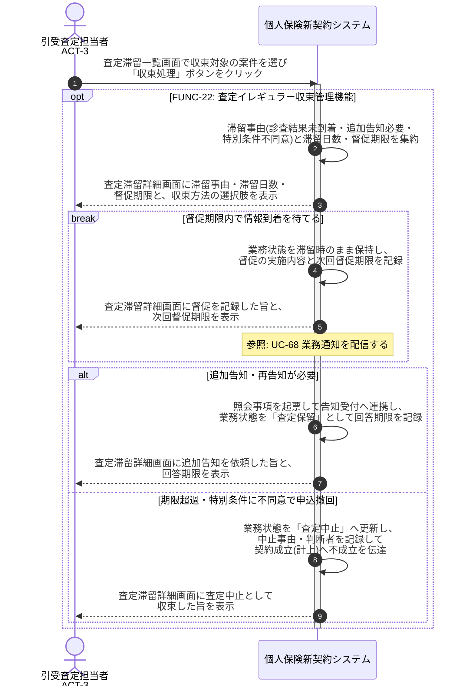

# UC-22: 査定イレギュラー案件を収束させる

- **事前条件**: 診査結果の長期未到着・告知内容への疑義・特別条件への申込人不同意 等により、業務状態が「診査待ち」または「査定保留」で滞留している
- **事後条件**: 督促・追加告知依頼・条件再交渉のいずれかにより査定が再開されるか、期限内に情報が揃わない場合は「査定中止」として収束し、後続の契約成立(計上)へ不成立が伝達された状態になる

