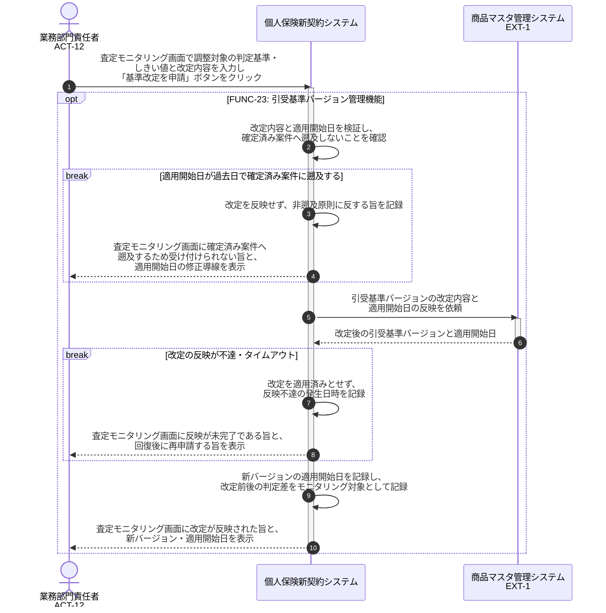

# UC-23: 自動判定基準を調整する

- **事前条件**: 判定結果モニタリングにより自動判定の品質逸脱や調整の必要性が検知されている
- **事後条件**: 調整内容が引受基準バージョンの改定として商品マスタ管理システムに反映され、新バージョンの適用開始日が記録される。確定済み案件の判定結果は遡及して変更されず、改定前後の判定差がモニタリング対象として記録された状態になる

```mermaid
sequenceDiagram
    autonumber
    actor act12 as 業務部門責任者<br/>ACT-12
    participant sys as 個人保険新契約システム
    participant ext1 as 商品マスタ管理システム<br/>EXT-1

    act12->>sys: 査定モニタリング画面で調整対象の判定基準・<br/>しきい値と改定内容を入力し<br/>「基準改定を申請」ボタンをクリック
    activate sys

    opt FUNC-23: 引受基準バージョン管理機能
        sys->>sys: 改定内容と適用開始日を検証し、<br/>確定済み案件へ遡及しないことを確認

        break 適用開始日が過去日で確定済み案件に遡及する
            sys->>sys: 改定を反映せず、非遡及原則に反する旨を記録
            sys-->>act12: 査定モニタリング画面に確定済み案件へ<br/>遡及するため受け付けられない旨と、<br/>適用開始日の修正導線を表示
        end

        sys->>ext1: 引受基準バージョンの改定内容と<br/>適用開始日の反映を依頼
        activate ext1
        ext1-->>sys: 改定後の引受基準バージョンと適用開始日
        deactivate ext1

        break 改定の反映が不達・タイムアウト
            sys->>sys: 改定を適用済みとせず、<br/>反映不達の発生日時を記録
            sys-->>act12: 査定モニタリング画面に反映が未完了である旨と、<br/>回復後に再申請する旨を表示
        end

        sys->>sys: 新バージョンの適用開始日を記録し、<br/>改定前後の判定差をモニタリング対象として記録
        sys-->>act12: 査定モニタリング画面に改定が反映された旨と、<br/>新バージョン・適用開始日を表示
    end

    deactivate sys
```
