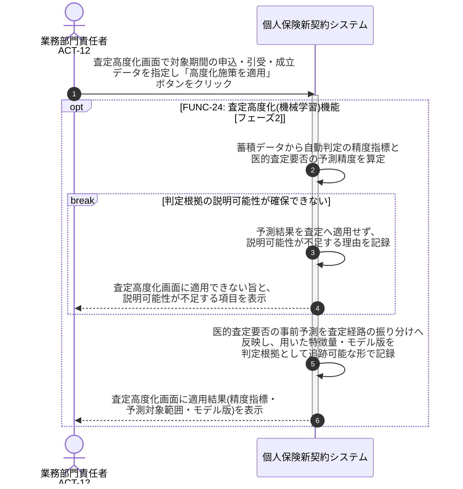

# UC-24: [フェーズ2] 機械学習で査定を高度化する

- **事前条件**: [フェーズ2] 申込・引受・成立データが高度化に必要な量まで蓄積されている
- **事後条件**: 機械学習による自動判定の精度向上と医的査定要否の事前予測が査定運用に反映され、予測に用いた特徴量・モデル版が判定根拠として追跡可能な状態で記録される。説明可能性が確保できない予測は査定に適用しない

```mermaid
sequenceDiagram
    autonumber
    actor act12 as 業務部門責任者<br/>ACT-12
    participant sys as 個人保険新契約システム

    act12->>sys: 査定高度化画面で対象期間の申込・引受・成立<br/>データを指定し「高度化施策を適用」<br/>ボタンをクリック
    activate sys

    opt FUNC-24: 査定高度化(機械学習)機能 [フェーズ2]
        sys->>sys: 蓄積データから自動判定の精度指標と<br/>医的査定要否の予測精度を算定

        break 判定根拠の説明可能性が確保できない
            sys->>sys: 予測結果を査定へ適用せず、<br/>説明可能性が不足する理由を記録
            sys-->>act12: 査定高度化画面に適用できない旨と、<br/>説明可能性が不足する項目を表示
        end

        sys->>sys: 医的査定要否の事前予測を査定経路の振り分けへ<br/>反映し、用いた特徴量・モデル版を<br/>判定根拠として追跡可能な形で記録
        sys-->>act12: 査定高度化画面に適用結果(精度指標・<br/>予測対象範囲・モデル版)を表示
    end

    deactivate sys
```
