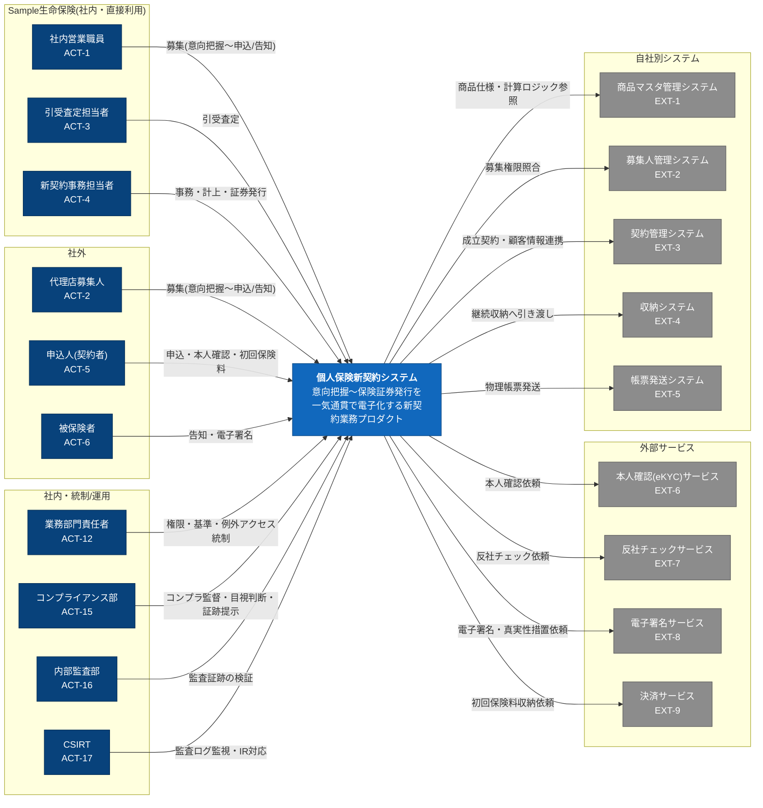

# C4モデル レベル1: システムコンテキスト

本図は、本システムに **直接情報を授受するアクター・外部システムのみ** を描いています。全アクターの網羅ではありません。モニタリング・管理・監督・サポート等で間接的に関与する業務関係者(受取人・営業所長/支社長・代理店店主・代理店本社担当者・経営層・IT部門責任者・募集人サポート担当・金融庁(監督官庁) 等)は、システムを直接操作・連携しないため本図および登場要素には含めません。これらを含む全アクターはアクター一覧を参照してください。

## 登場要素

システムと直接情報を授受する要素のみを掲載します(間接的に関与する業務関係者は含めません)。

| ID | 種別 | 名称 | 説明・責務 | 参照元 |
|---|---|---|---|---|
| — | 対象システム | 個人保険新契約システム | 意向把握〜保険証券発行を一気通貫で電子化する新契約業務プロダクト | PRD §プロダクト概要 |
| ACT-1 | 人 | 社内営業職員 | 意向把握〜設計書作成・申込/告知受付を対面/非対面で実施する | アクター一覧 |
| ACT-2 | 人 | 代理店募集人 | 代理店所属の募集人。社内営業職員と同様の募集業務を実施する | アクター一覧 |
| ACT-3 | 人 | 引受査定担当者 | 告知・診査・環境査定をもとに引受可否・特別条件を判定する | アクター一覧 |
| ACT-4 | 人 | 新契約事務担当者 | 不備対応・第一回保険料収納確認・契約成立(計上)・証券発行を実施する | アクター一覧 |
| ACT-5 | 人 | 申込人(契約者) | 申込意思を確定し、申込情報・払込方法・受取人指定 等を提供する。成立後は証券を受領する | アクター一覧 |
| ACT-6 | 人 | 被保険者 | 健康状態・職業 等を本人入力し告知義務を負う | アクター一覧 |
| ACT-12 | 人 | 業務部門責任者(新契約部門) | アクセス権限の申請・承認・棚卸、引受基準調整、例外アクセスを統制する | アクター一覧 |
| ACT-15 | 人 | コンプライアンス部 | 募集コンプライアンスを監督し、KYC/反社の目視判断・証跡提示を行う | アクター一覧 |
| ACT-16 | 人 | 内部監査部 | 内部監査を実施し、監査ログ・アクセス制御の妥当性を検証する | アクター一覧 |
| ACT-17 | 人 | CSIRT | セキュリティインシデントの検知・対応、監査ログを監視する | アクター一覧 |
| EXT-1 | 外部システム | 商品マスタ管理システム | 商品・特約選択および保険料試算で最新の商品仕様・計算ロジックを参照する | 外部システム一覧 |
| EXT-2 | 外部システム | 募集人管理システム | 募集権限照合のため募集人・代理店情報と権限を参照する | 外部システム一覧 |
| EXT-3 | 外部システム | 契約管理システム | 契約成立(計上)時に成立契約・確定顧客情報を引き渡す | 外部システム一覧 |
| EXT-4 | 外部システム | 収納システム | 契約成立後の継続収納へ成立契約情報を引き渡す | 外部システム一覧 |
| EXT-5 | 外部システム | 帳票発送システム | 保険証券 等の物理帳票の発送を委託する | 外部システム一覧 |
| EXT-6 | 外部システム | 本人確認(eKYC)サービス | 申込時の取引時確認(本人特定事項の確認)を委託する | 外部システム一覧 |
| EXT-7 | 外部システム | 反社チェックサービス | 契約関係者の反社該当性照合を委託する | 外部システム一覧 |
| EXT-8 | 外部システム | 電子署名サービス | 確定文書への本人電子署名・検証・真実性措置付与を委託する | 外部システム一覧 |
| EXT-9 | 外部システム | 決済サービス | 第一回保険料の収納を委託する | 外部システム一覧 |
